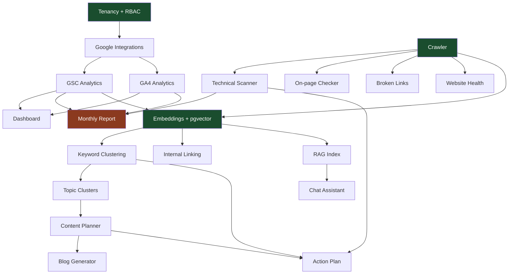

# 02 — Features

Sections §5–§6. [← Back to index](../README.md)

---

## §5. Complete Feature List

Each module below states its **data source**, the **AI's role** (or absence), the
**deliverable**, and a **$0 rating**:

| Rating | Meaning |
|---|---|
| ✅ **Full** | Works completely at $0 with no compromise |
| ⚠️ **Partial** | Core works at $0; a named sub-capability is degraded or missing |
| 🔌 **Adapter** | Works at $0 in reduced form; an opt-in paid adapter improves it |

**Totals: 21 Full · 6 Partial · 1 N/A.**

---

### Group A — Analytics & Data

#### 1. Dashboard ✅ Full

The landing surface. Cross-client if you're an agency, single-site if you're in-house.

- **Data source:** everything already in Postgres — no external calls at render time
- **AI role:** one generated paragraph ("what changed and why") from the Report Narrator agent
- **Deliverable:** at-a-glance health across all clients; a ranked "needs attention" list
- **Detail:** widget grid documented in §11. Every widget reads from a materialised view
  refreshed by the worker, so the page loads in <200 ms regardless of data volume.

#### 2. Search Console Analytics ✅ Full

The single most important module in the product.

- **Data source:** GSC Search Analytics API — free, unlimited within generous quota
- **AI role:** none for the data; the Chat Assistant queries it
- **Deliverable:** queries, pages, countries, devices, dates — with position, impressions,
  clicks, CTR; period-over-period comparison; query→page mapping
- **Detail:** 16 months of history, 25,000 rows per request with pagination. Synced nightly
  into `gsc_daily` (partitioned by month). This is where rank data comes from — measured by
  Google, not estimated by a crawler. Includes the derived **opportunity score**: high
  impressions × low CTR × position 5–20 = the classic quick win.

#### 3. GA4 Analytics ✅ Full

- **Data source:** GA4 Data API — free, token-quota'd (see §38)
- **AI role:** none for the data; feeds the Report Narrator
- **Deliverable:** sessions, engaged sessions, conversions, revenue by landing page, channel,
  and date; joined to GSC on landing page so rankings connect to outcomes
- **Detail:** the join is the point. `gsc_daily.page = ga4_daily.landing_page` turns "we rank
  #4" into "we rank #4 and it produced 22 conversions." Very few tools do this well.

#### 18. Website Health ✅ Full

- **Data source:** local Lighthouse CLI + own crawler + GSC Index Coverage
- **AI role:** prioritisation and plain-English explanation of each issue
- **Deliverable:** a single 0–100 health score per site with the components exposed
- **Detail:** running Lighthouse locally rather than via the PageSpeed API removes the
  25,000/day quota entirely — you can audit every page of every client site nightly if you
  want. Score composition documented in §43.

---

### Group B — Technical SEO

#### 4. Technical SEO Scanner ✅ Full

The Screaming Frog replacement.

- **Data source:** own crawler — httpx (async) + selectolax (fast HTML parsing)
- **AI role:** groups raw findings into themed issues and writes the remediation steps
- **Deliverable:** a prioritised issue list with affected URLs and fix instructions
- **Detail:** crawls status codes, redirect chains, canonicals, hreflang, meta robots,
  robots.txt, XML sitemaps, indexability, title/meta length, H1 structure, thin content,
  duplicate content (via embedding similarity), orphan pages, crawl depth, and internal link
  distribution. Respects robots.txt and rate-limits per host. **Diffs against the previous
  crawl** so the weekly run surfaces *what changed*, not the same 400 issues every week.

#### 12. Broken Link Detection ✅ Full

- **Data source:** own crawler
- **AI role:** none — this is deterministic
- **Deliverable:** internal and external broken links with their source pages
- **Detail:** separated from the main scanner because external link checking has different
  rate-limit and timeout behaviour, and because clients ask for this one by name. Checks
  outbound links with HEAD requests, falls back to ranged GET for servers that reject HEAD.

#### 13. On-page SEO Checker ✅ Full

- **Data source:** own crawler + GSC (which query does this page actually rank for?)
- **AI role:** scores content against intent, suggests improvements
- **Deliverable:** per-page scorecard with concrete fixes
- **Detail:** the Surfer replacement, with an advantage — Surfer guesses the target keyword;
  this reads it from GSC. Checks title/meta/H1 alignment with the ranking query, keyword
  placement, content depth versus competitors, internal links in and out, schema presence,
  image alt text, and readability.

#### 10. Schema Generator ✅ Full

- **Data source:** crawled page content + site metadata
- **AI role:** extracts entities and populates the schema; output constrained to a JSON
  schema so it is valid by construction
- **Deliverable:** copy-paste JSON-LD, or push directly via the WordPress integration
- **Detail:** supports Article, Product, FAQ, HowTo, LocalBusiness, Organization, BreadcrumbList,
  and Review. Validates against schema.org before presenting. This is a textbook case for
  Ollama's `format` parameter — no regex scraping, no retry loop.

#### 11. Internal Linking AI ✅ Full

- **Data source:** own crawl + local embeddings of every page
- **AI role:** semantic relevance scoring and anchor text generation
- **Deliverable:** ranked link suggestions — from page, to page, anchor text, where to place it
- **Detail:** builds the full internal link graph, computes an internal PageRank, finds
  orphan and under-linked pages, then uses cosine similarity over page embeddings to propose
  contextually relevant links. Excludes pairs already linked. One of the highest-ROI modules
  and one of the cheapest to run — it is mostly vector math, not generation.

---

### Group C — Research & Strategy

#### 6. Keyword Clustering ✅ Full

- **Data source:** GSC queries (free, client-specific, already proven to rank) + optional
  Google Ads Keyword Planner volumes
- **AI role:** embeddings for clustering; the model only labels the resulting clusters
- **Deliverable:** query clusters with aggregate impressions, average position, and
  opportunity score
- **Detail:** the important design choice — **cluster with embeddings, not with the LLM.**
  Embedding 4,000 queries costs seconds and is deterministic; asking a 9B model to cluster
  them is slow and inconsistent. HDBSCAN over nomic-embed vectors, then one cheap LLM call
  per cluster to name it. See §20.

#### 7. Topic Cluster Generator ✅ Full

- **Data source:** keyword clusters from module 6 + existing site content
- **AI role:** designs the pillar-and-spoke structure
- **Deliverable:** a topic map — pillar page, supporting pages, internal linking plan, and
  which pieces already exist versus need writing
- **Detail:** maps proposed clusters against crawled content to find what you already have.
  Prevents the standard failure of "here are 40 articles to write" when 25 already exist.

#### 5. Content Gap Analysis ⚠️ Partial

- **Data source:** own crawl of competitor sites (free) + your own content
- **AI role:** topic extraction, entity comparison, gap identification
- **Deliverable:** topics competitors cover that you don't, ranked by relevance
- **✅ What works at $0:** crawl any competitor directly, embed their content, compare topical
  coverage against yours. Genuinely useful, and something most tools don't do well.
- **❌ What doesn't:** *which keywords they rank for and how much traffic it earns.* That
  needs a proprietary keyword-ranking index. No free source exists.
- **The honest framing:** you learn what they *wrote about*, not what they *win on*. For
  content planning that's often sufficient; for competitive bidding it isn't.

#### 17. Competitor Analysis ⚠️ Partial

- **Data source:** own crawl of competitor sites + Wappalyzer-style tech fingerprinting
- **AI role:** structural and strategic analysis
- **Deliverable:** competitor profile — content themes, publishing cadence, site structure,
  schema usage, internal linking patterns, tech stack
- **✅ What works:** everything observable by crawling. Site architecture, content depth,
  update frequency, schema, page speed, how they structure topic clusters.
- **❌ What doesn't:** their ranking keywords, traffic estimates, and backlink profile.
- **🔌 Adapter:** `SerpProvider` (§24) can supply "who ranks for query X" if enabled.

#### 14. Entity Optimization ✅ Full

- **Data source:** Wikidata + Wikipedia APIs (both free, no key) + local NER
- **AI role:** entity extraction and salience scoring
- **Deliverable:** entities your page covers, entities it should cover, and how to add them
- **Detail:** a genuinely underserved feature that happens to be free. Extracts entities from
  your content and from top-ranking competitor content, resolves them against Wikidata,
  compares coverage. Feeds directly into the content brief.

#### 15. AI Overview Optimization ⚠️ Partial

- **Data source:** SERP fetch (`SerpProvider`)
- **AI role:** analyses what gets cited in AI Overviews and why
- **Deliverable:** which of your queries trigger AI Overviews, whether you're cited, and what
  to change
- **⚠️ The limit:** requires SERP fetching, which the local scraper caps at roughly 200–300
  queries/day before CAPTCHAs. Fine for spot-checking your top 50 queries weekly; not for
  monitoring thousands.
- **🔌 Adapter:** ApifyProvider removes the ceiling if enabled.

#### 16. Backlink Tracker ⚠️ Partial

- **Data source:** GSC Links report (your own sites) + Common Crawl (competitors, batch)
- **AI role:** classifies link quality and flags losses
- **Deliverable:** referring domains, top linked pages, anchor text distribution, new and
  lost links
- **✅ What works: your clients' own backlinks, completely.** GSC reports them free. For
  client reporting — which is what backlink data is mostly used for — this is sufficient.
- **❌ What doesn't:** competitor backlink profiles. There is no free live link index, and
  this document does not pretend Common Crawl is an equivalent substitute. It is a 400 TB
  batch dataset, useful for a one-off analysis, not a monitoring feed.
- **This is the module that genuinely degrades and stays degraded.** See §56.

---

### Group D — Content Production

#### 8. AI Content Planner ✅ Full

- **Data source:** keyword clusters, GSC opportunity scores, existing content inventory
- **AI role:** prioritisation and calendar construction
- **Deliverable:** a dated content calendar with target queries, intent, format, and
  estimated impact per piece
- **Detail:** ranks by opportunity score rather than raw volume. A query at position 11 with
  8,000 impressions and 0.4% CTR is worth more than an unranked 10,000-volume head term, and
  the planner knows that because GSC told it.

#### 9. AI Blog Generator ⚠️ Partial

- **Data source:** the brief, brand voice memory, crawled competitor content, entity list
- **AI role:** the whole pipeline
- **Deliverable:** a draft with title, meta description, headings, body, internal links, and
  JSON-LD
- **⚠️ The limit:** Qwen 3.5 9B is genuinely weaker than a frontier model at publishable
  long-form prose in one pass.
- **The mitigation (this is the design, not a workaround):** never generate long-form in one
  pass. Research → structured brief → outline → **human approves the outline** →
  section-by-section generation, each section given only its own outline node and the
  preceding section's last paragraph → editing pass for voice and flow → fact-check pass
  against source data. Chunking is why this works at 9B; the same technique is already proven
  in `Growleads L.S`'s clip scoring.
- **🔌 Adapter:** `RemoteProvider` (BYO API key) for a specific high-stakes deliverable. Off
  by default; the platform never carries the cost.

#### 22. Action Plan Generator ✅ Full

- **Data source:** every finding across every module
- **AI role:** synthesis, prioritisation, effort/impact estimation
- **Deliverable:** "the 10 things to do this week," ranked, with effort estimates and owners
- **Detail:** arguably the module that best justifies having an AI at all. Reconciles
  technical issues, content gaps, ranking movements, and internal link opportunities into a
  single ordered list. This is what Persona 4 (Sneha) and Persona 5 (Vikram) actually want.

---

### Group E — Reporting & Interaction

#### 19. Weekly Report Generator ✅ Full

- **Data source:** all modules, diffed against the previous week
- **AI role:** narrative generation
- **Deliverable:** a short internal report — what moved, what broke, what was done
- **Detail:** built for the agency's own Monday standup, not the client. Terse and diff-based.

#### 20. Monthly Report Generator ✅ Full

- **Data source:** all modules, month-over-month and year-over-year
- **AI role:** narrative, executive summary, next-month recommendations
- **Deliverable:** a white-labelled client-facing PDF or shareable HTML page
- **Detail:** the module with the clearest ROI (Problem 3 in §2). Agency logo, client
  branding, configurable sections. Generated by the worker on a schedule; the SEO edits the
  narrative before sending.

#### 21. AI Chat Assistant ✅ Full

- **Data source:** RAG over the entire Postgres dataset + pgvector index (§19)
- **AI role:** the whole feature
- **Deliverable:** conversational answers with the underlying numbers cited
- **Detail:** "Why did traffic drop on the blog last month?" → retrieves relevant GSC and
  GA4 rows, crawl diffs, and rank history, then answers with citations back to the data.
  Streams via SSE. Every claim links to the row that supports it, so the SEO can verify
  before repeating it to a client.

---

### Group F — Platform

#### 23. Role Based Access ✅ Full

Five roles: `owner`, `admin`, `strategist`, `writer`, `client_viewer`. Enforced at the API
layer and again by Postgres RLS (§28). `client_viewer` is the important one — a read-only
link a client can open to see their own site's dashboard and reports, nothing else.

#### 24. Multi Client Management ✅ Full

Organization → Client → Site hierarchy. Client switcher in the top bar, cross-client
dashboard, bulk operations (crawl all, report all), per-client settings and brand voice.
This is core, not an add-on — the schema has `org_id` on every table from migration one.

#### 25. Notifications ✅ Full

In-app notification centre plus email via Gmail SMTP (free at agency volume — 500/day).
Triggers: crawl finished, new critical issue, ranking drop beyond threshold, report ready,
job failed. Per-user preferences and digest batching so it doesn't become noise.

#### 26. Settings ✅ Full

Org settings, client settings, per-site crawl configuration, brand voice profiles, notification
preferences, AI provider selection (`LocalProvider` / `RemoteProvider`), SERP provider
selection (`LocalScraper` / `ApifyProvider`), API key management for the adapters.

#### 27. Billing — N/A

Not applicable to a local single-tenant deployment. The schema reserves `subscriptions` and
`usage_events` tables so the module can be added without a migration if the product is ever
hosted (§51), but nothing is built.

#### 28. Integrations ✅ Full

| Integration | Direction | Auth | Purpose |
|---|---|---|---|
| Google Search Console | Read | OAuth 2.0 | Rankings, queries, links, index coverage |
| Google Analytics 4 | Read | OAuth 2.0 | Traffic, conversions, revenue |
| Google Business Profile | Read | OAuth 2.0 | Local rankings, reviews, insights |
| Google Ads (Keyword Planner) | Read | OAuth 2.0 + dev token | Search volumes |
| Google Indexing API | Write | Service account | Push URLs for recrawl (200/day) |
| WordPress | Read/Write | Application Password | Publish drafts, push schema, read content |
| Wikidata / Wikipedia | Read | None | Entity resolution |
| Ollama | Local | None | All AI inference |

---

## §6. Feature Priority

### The prioritisation rule

Ship in the order that produces a **client-visible deliverable soonest**. A half-built
platform that can generate one real monthly report is more useful than a fully-built platform
that can't yet. Each phase below ends with something you could hand to a client.

---

### MVP — Phase 1 (12 modules, ~10 weeks)

**Goal: replace the reporting stack. First real client report generated from the tool.**

| Module | Why it's in MVP |
|---|---|
| 24. Multi Client Management | Everything else needs the tenancy model to exist first |
| 23. Role Based Access | Cheaper to build now than to retrofit; RLS policies go in migration one |
| 28. Integrations (GSC, GA4) | Without data there is no product |
| 2. Search Console Analytics | The single highest-value module |
| 3. GA4 Analytics | Turns rankings into business outcomes |
| 1. Dashboard | The surface everything renders on |
| 4. Technical SEO Scanner | The crawler is a dependency for 6 other modules — build it early |
| 13. On-page SEO Checker | Almost free once the crawler exists |
| 12. Broken Link Detection | Same crawler, deterministic, clients ask for it by name |
| 18. Website Health | Local Lighthouse; ties the technical modules into one score |
| 20. Monthly Report Generator | **The deliverable that justifies the whole build** |
| 26. Settings | Needed to configure anything above |

**MVP explicitly excludes** all content generation and all competitor work. Those are where
the local model is weakest and where the free-data story is thinnest — do them second, with
the platform already earning its keep.

**Definition of done:** connect a real client's GSC and GA4, run a crawl, generate a monthly
report that Anuj would actually send.

---

### Phase 2 (9 modules, ~8 weeks)

**Goal: replace the research and content-planning stack.**

| Module | Why here, not MVP |
|---|---|
| 6. Keyword Clustering | Needs the embedding pipeline, which needs pgvector configured |
| 7. Topic Cluster Generator | Depends on clustering |
| 8. AI Content Planner | Depends on clustering + content inventory |
| 11. Internal Linking AI | Depends on crawl + embeddings |
| 10. Schema Generator | Self-contained; good first test of constrained decoding |
| 14. Entity Optimization | Free APIs, high value, no dependency on paid data |
| 21. AI Chat Assistant | Needs the RAG index, which needs most data flowing first |
| 19. Weekly Report Generator | Trivial once monthly exists |
| 25. Notifications | Only meaningful once there are scheduled jobs producing events |

**Definition of done:** a content calendar generated from GSC data, with briefs, for a real
client.

---

### Phase 3 (5 modules, ~6 weeks)

**Goal: content production and competitive work — the harder, lower-certainty modules.**

| Module | Risk |
|---|---|
| 9. AI Blog Generator | Prose quality at 9B. Build the pipeline, measure honestly, decide |
| 22. Action Plan Generator | Needs every other module producing findings first |
| 5. Content Gap Analysis | Partial by nature; ship the topical-gap version |
| 17. Competitor Analysis | Partial by nature; ship the crawl-based version |
| 16. Backlink Tracker | GSC-based own-site version only |

**Definition of done:** a published blog post that went brief → outline → draft → edit →
WordPress without leaving the tool.

---

### Phase 4 — Later, or never

| Module | Condition for building it |
|---|---|
| 15. AI Overview Optimization | Build when SERP data is reliable — i.e. if the Apify adapter gets switched on |
| 27. Billing | Only if the product is ever hosted for third parties (§51) |
| Google Business Profile | Build when a client actually needs local SEO |
| Google Indexing API | Low effort, low urgency — 200 URLs/day is a narrow tool |
| Public tools site | Independent of the main app; can be built any time. See §44 |

---

### Dependency graph

Green nodes are the three foundations — tenancy, the crawler, and the embedding pipeline.
Every other module depends on at least one of them, so build order is not negotiable. The
orange node is the MVP's definition of done.

---

[← 01 Product Vision](01-product-vision.md) · [Index](../README.md) · [Next: 03 — User Journeys →](03-user-journeys.md)
