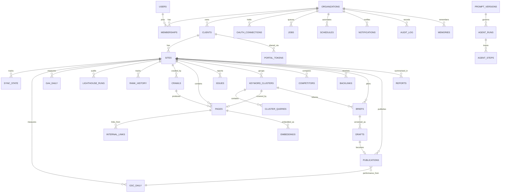

# 05 — Database

Sections §13–§14. [← Back to index](../README.md)

---

## §13. Complete Database Schema

**Postgres 16 + pgvector.** One database, one instance, running in Docker on the same
machine as everything else.

### Why Postgres and not SQLite

`Growleads L.S` uses SQLite and that was correct there — single user, single process, no
concurrency. This is different: a web app, a worker pool, and scheduled jobs all write
concurrently, and the workload needs `JSONB`, partitioning, full-text search, and vector
similarity in the same query.

| Option | Verdict |
|---|---|
| **SQLite + sqlite-vec** | Zero setup, single file. But write-locks under concurrent workers, no native partitioning, weaker JSONB, and `sqlite-vec` is younger than pgvector. |
| **Postgres 16 + pgvector** | One extra container. Gets MVCC (workers and web never block each other), declarative partitioning for the time-series tables, mature `JSONB`, `tsvector` full-text, and pgvector's HNSW index — all in one place. |
| Postgres + separate Qdrant | Better vector performance above ~10M vectors. Two services, two backup stories, and a join across a network boundary. |

**Recommendation: Postgres 16 + pgvector.** The concurrency argument alone decides it — a
worker running a 40-minute crawl must not block the dashboard. Keeping vectors in the same
database means "find pages similar to this one, that are also on this site, and have GSC
impressions above 100" is a single SQL query rather than an application-level join. §21 sets
the numeric threshold at which moving to Qdrant would be justified.

### Conventions

- **`id`**: `uuid` with `gen_random_uuid()` default. Not bigserial — IDs appear in URLs and
  API responses, and sequential integers leak volume.
- **`org_id`** on every tenant-scoped table, always, even where it is derivable by join. This
  is what makes RLS policies simple and fast (§28).
- **Timestamps**: `timestamptz`, never `timestamp`. All storage in UTC; display converts.
- **Soft delete**: `deleted_at timestamptz` on user-facing entities. Hard delete on
  derived data.
- **Naming**: snake_case, plural tables, singular columns, `_at` suffix on timestamps,
  `_id` suffix on FKs.

---

### 13.1 Extensions and enums

```sql
CREATE EXTENSION IF NOT EXISTS pgcrypto;    -- gen_random_uuid(), digest()
CREATE EXTENSION IF NOT EXISTS vector;      -- pgvector
CREATE EXTENSION IF NOT EXISTS pg_trgm;     -- fuzzy text search on queries/URLs
CREATE EXTENSION IF NOT EXISTS btree_gin;   -- composite GIN indexes

CREATE TYPE user_role       AS ENUM ('owner','admin','strategist','writer','client_viewer');
CREATE TYPE job_status      AS ENUM ('queued','running','succeeded','failed','dead');
CREATE TYPE issue_severity  AS ENUM ('critical','warning','notice');
CREATE TYPE issue_state     AS ENUM ('open','resolved','ignored');
CREATE TYPE content_state   AS ENUM ('idea','brief','drafting','review','approved','published');
CREATE TYPE search_intent   AS ENUM ('informational','commercial','transactional','navigational');
CREATE TYPE provider_kind   AS ENUM ('local','remote');
```

---

### 13.2 Tenancy

The hierarchy is **Organization → Client → Site**. An agency is one organization with many
clients; an in-house team is one organization with one client.

```sql
CREATE TABLE organizations (
    id              uuid PRIMARY KEY DEFAULT gen_random_uuid(),
    name            text NOT NULL,
    slug            text NOT NULL UNIQUE,
    logo_path       text,                       -- local path, see §23
    brand_color     text DEFAULT '#1a4d2e',
    settings        jsonb NOT NULL DEFAULT '{}'::jsonb,
    created_at      timestamptz NOT NULL DEFAULT now(),
    updated_at      timestamptz NOT NULL DEFAULT now(),
    deleted_at      timestamptz
);

CREATE TABLE users (
    id              uuid PRIMARY KEY DEFAULT gen_random_uuid(),
    email           citext NOT NULL UNIQUE,
    name            text,
    avatar_url      text,
    google_sub      text UNIQUE,                -- Google's stable subject id
    last_seen_at    timestamptz,
    created_at      timestamptz NOT NULL DEFAULT now(),
    deleted_at      timestamptz
);

CREATE TABLE memberships (
    id              uuid PRIMARY KEY DEFAULT gen_random_uuid(),
    org_id          uuid NOT NULL REFERENCES organizations(id) ON DELETE CASCADE,
    user_id         uuid NOT NULL REFERENCES users(id) ON DELETE CASCADE,
    role            user_role NOT NULL DEFAULT 'strategist',
    -- client_viewer role is scoped to specific clients; NULL means all clients in org
    client_scope    uuid[],
    created_at      timestamptz NOT NULL DEFAULT now(),
    UNIQUE (org_id, user_id)
);

CREATE TABLE clients (
    id              uuid PRIMARY KEY DEFAULT gen_random_uuid(),
    org_id          uuid NOT NULL REFERENCES organizations(id) ON DELETE CASCADE,
    name            text NOT NULL,
    industry        text,
    -- brand voice used by every content module; see §22
    brand_voice     jsonb NOT NULL DEFAULT '{}'::jsonb,
    settings        jsonb NOT NULL DEFAULT '{}'::jsonb,
    created_at      timestamptz NOT NULL DEFAULT now(),
    updated_at      timestamptz NOT NULL DEFAULT now(),
    deleted_at      timestamptz
);

CREATE TABLE sites (
    id                  uuid PRIMARY KEY DEFAULT gen_random_uuid(),
    org_id              uuid NOT NULL REFERENCES organizations(id) ON DELETE CASCADE,
    client_id           uuid NOT NULL REFERENCES clients(id) ON DELETE CASCADE,
    domain              text NOT NULL,               -- 'acme.com'
    start_url           text NOT NULL,               -- 'https://acme.com/'
    is_primary          boolean NOT NULL DEFAULT false,
    -- external property identifiers
    gsc_property        text,                        -- 'sc-domain:acme.com'
    ga4_property_id     text,                        -- 'properties/123456789'
    gbp_location_id     text,
    -- crawl configuration
    crawl_config        jsonb NOT NULL DEFAULT
        '{"max_pages":5000,"max_depth":10,"delay_ms":250,"respect_robots":true,
          "include":[],"exclude":["/wp-admin/","/cart/","?"]}'::jsonb,
    created_at          timestamptz NOT NULL DEFAULT now(),
    updated_at          timestamptz NOT NULL DEFAULT now(),
    deleted_at          timestamptz,
    UNIQUE (org_id, domain)
);

CREATE INDEX ON memberships (user_id);
CREATE INDEX ON clients (org_id) WHERE deleted_at IS NULL;
CREATE INDEX ON sites (org_id, client_id) WHERE deleted_at IS NULL;
```

**Client portal tokens** — how a `client_viewer` link works without an account:

```sql
CREATE TABLE portal_tokens (
    id              uuid PRIMARY KEY DEFAULT gen_random_uuid(),
    org_id          uuid NOT NULL REFERENCES organizations(id) ON DELETE CASCADE,
    client_id       uuid NOT NULL REFERENCES clients(id) ON DELETE CASCADE,
    token_hash      text NOT NULL UNIQUE,        -- sha256 of the token; raw shown once
    passcode_hash   text,                        -- optional second factor
    sections        jsonb NOT NULL DEFAULT '["overview","reports","content"]'::jsonb,
    expires_at      timestamptz,
    last_viewed_at  timestamptz,
    view_count      integer NOT NULL DEFAULT 0,
    revoked_at      timestamptz,
    created_at      timestamptz NOT NULL DEFAULT now()
);
```

The raw token is never stored — only its SHA-256. A leaked database backup cannot be turned
into working portal links.

---

### 13.3 Integrations

```sql
CREATE TABLE oauth_connections (
    id                  uuid PRIMARY KEY DEFAULT gen_random_uuid(),
    org_id              uuid NOT NULL REFERENCES organizations(id) ON DELETE CASCADE,
    user_id             uuid NOT NULL REFERENCES users(id) ON DELETE CASCADE,
    provider            text NOT NULL,           -- 'google'
    -- Encrypted at rest with an app-held key; see §29. Never plaintext.
    access_token_enc    bytea NOT NULL,
    refresh_token_enc   bytea NOT NULL,
    token_expires_at    timestamptz NOT NULL,
    scopes              text[] NOT NULL,
    account_email       text,
    revoked_at          timestamptz,
    created_at          timestamptz NOT NULL DEFAULT now(),
    updated_at          timestamptz NOT NULL DEFAULT now(),
    UNIQUE (org_id, user_id, provider)
);

-- Per-site, per-source sync watermark. Makes every sync incremental and resumable.
CREATE TABLE sync_state (
    id                  uuid PRIMARY KEY DEFAULT gen_random_uuid(),
    org_id              uuid NOT NULL REFERENCES organizations(id) ON DELETE CASCADE,
    site_id             uuid NOT NULL REFERENCES sites(id) ON DELETE CASCADE,
    source              text NOT NULL,           -- 'gsc' | 'ga4' | 'gbp'
    last_synced_date    date,                    -- watermark
    last_run_at         timestamptz,
    last_error          text,
    rows_ingested       bigint NOT NULL DEFAULT 0,
    UNIQUE (site_id, source)
);
```

**Why the watermark matters:** GSC data for a given day is not final for ~3 days. The sync
job re-pulls a rolling 5-day window rather than only new dates, and upserts. `last_synced_date`
tracks the oldest date still considered volatile, not simply the newest date seen.

---

### 13.4 Metrics — the time-series core

These are the largest tables. `gsc_daily` for one site with 3,000 queries produces ~1.1M rows
a year. Fifteen clients over two years is ~33M rows. Partitioning is not premature here.

```sql
CREATE TABLE gsc_daily (
    org_id          uuid NOT NULL,
    site_id         uuid NOT NULL,
    date            date NOT NULL,
    query           text NOT NULL,
    page            text NOT NULL,
    country         char(3) NOT NULL DEFAULT 'zzz',
    device          text NOT NULL DEFAULT 'ALL',
    clicks          integer NOT NULL DEFAULT 0,
    impressions     integer NOT NULL DEFAULT 0,
    ctr             real NOT NULL DEFAULT 0,
    position        real NOT NULL DEFAULT 0,
    PRIMARY KEY (site_id, date, query, page, country, device)
) PARTITION BY RANGE (date);

-- One partition per month; created 3 months ahead by a scheduled job.
CREATE TABLE gsc_daily_2026_11 PARTITION OF gsc_daily
    FOR VALUES FROM ('2026-11-01') TO ('2026-12-01');

CREATE INDEX ON gsc_daily (site_id, date DESC);
CREATE INDEX ON gsc_daily (site_id, query text_pattern_ops);
CREATE INDEX ON gsc_daily (site_id, page text_pattern_ops);
-- trigram index for the "search your queries" box
CREATE INDEX gsc_query_trgm ON gsc_daily USING gin (query gin_trgm_ops);

CREATE TABLE ga4_daily (
    org_id              uuid NOT NULL,
    site_id             uuid NOT NULL,
    date                date NOT NULL,
    landing_page        text NOT NULL,
    channel             text NOT NULL DEFAULT 'organic',
    sessions            integer NOT NULL DEFAULT 0,
    engaged_sessions    integer NOT NULL DEFAULT 0,
    conversions         numeric(12,2) NOT NULL DEFAULT 0,
    revenue             numeric(14,2) NOT NULL DEFAULT 0,
    PRIMARY KEY (site_id, date, landing_page, channel)
) PARTITION BY RANGE (date);

CREATE INDEX ON ga4_daily (site_id, date DESC);
CREATE INDEX ON ga4_daily (site_id, landing_page text_pattern_ops);
```

**The join that makes the product valuable:**

```sql
-- Rankings tied to business outcomes, per landing page.
SELECT  g.page,
        sum(g.clicks)                         AS clicks,
        avg(g.position)                       AS avg_position,
        sum(a.conversions)                    AS conversions,
        sum(a.revenue)                        AS revenue
FROM    gsc_daily g
LEFT JOIN ga4_daily a
       ON a.site_id = g.site_id
      AND a.date    = g.date
      AND a.landing_page = g.page
WHERE   g.site_id = $1
  AND   g.date >= current_date - 28
GROUP BY g.page
ORDER BY revenue DESC NULLS LAST;
```

Lighthouse and rank history:

```sql
CREATE TABLE lighthouse_runs (
    id              uuid PRIMARY KEY DEFAULT gen_random_uuid(),
    org_id          uuid NOT NULL,
    site_id         uuid NOT NULL REFERENCES sites(id) ON DELETE CASCADE,
    url             text NOT NULL,
    strategy        text NOT NULL DEFAULT 'mobile',   -- mobile | desktop
    performance     smallint, accessibility smallint,
    best_practices  smallint, seo smallint,
    lcp_ms          integer, cls numeric(5,3), inp_ms integer, ttfb_ms integer,
    raw_path        text,                              -- full JSON report on disk, §23
    run_at          timestamptz NOT NULL DEFAULT now()
);
CREATE INDEX ON lighthouse_runs (site_id, url, run_at DESC);

-- Only for queries where GSC has no data (competitor tracking, non-owned sites).
CREATE TABLE rank_history (
    id              uuid PRIMARY KEY DEFAULT gen_random_uuid(),
    org_id          uuid NOT NULL,
    site_id         uuid NOT NULL REFERENCES sites(id) ON DELETE CASCADE,
    query           text NOT NULL,
    date            date NOT NULL,
    position        real,
    url             text,
    serp_features   text[],                    -- ai_overview, featured_snippet, paa, …
    source          text NOT NULL DEFAULT 'local_scraper',   -- or 'apify'
    UNIQUE (site_id, query, date)
);
```

**Design note:** `rank_history` exists *only* for queries GSC cannot answer. For a site you
own, GSC's `position` is the source of truth — measured, not sampled. Duplicating it here
would create two conflicting numbers, which is worse than having one.

---

### 13.5 Crawl and SEO objects

```sql
CREATE TABLE crawls (
    id              uuid PRIMARY KEY DEFAULT gen_random_uuid(),
    org_id          uuid NOT NULL,
    site_id         uuid NOT NULL REFERENCES sites(id) ON DELETE CASCADE,
    started_at      timestamptz NOT NULL DEFAULT now(),
    finished_at     timestamptz,
    pages_crawled   integer NOT NULL DEFAULT 0,
    pages_failed    integer NOT NULL DEFAULT 0,
    status          job_status NOT NULL DEFAULT 'running',
    error           text
);

CREATE TABLE pages (
    id                  uuid PRIMARY KEY DEFAULT gen_random_uuid(),
    org_id              uuid NOT NULL,
    site_id             uuid NOT NULL REFERENCES sites(id) ON DELETE CASCADE,
    url                 text NOT NULL,
    url_hash            text GENERATED ALWAYS AS (encode(digest(url,'sha256'),'hex')) STORED,
    -- response
    status_code         smallint,
    redirect_to         text,
    content_type        text,
    -- on-page
    title               text,
    meta_description    text,
    h1                  text,
    canonical           text,
    meta_robots         text,
    lang                text,
    word_count          integer,
    -- extracted
    body_text           text,
    schema_types        text[],
    -- structure
    depth               smallint,
    inlinks_count       integer NOT NULL DEFAULT 0,
    outlinks_count      integer NOT NULL DEFAULT 0,
    internal_pagerank   real,
    -- lifecycle
    first_seen_at       timestamptz NOT NULL DEFAULT now(),
    last_crawled_at     timestamptz NOT NULL DEFAULT now(),
    last_crawl_id       uuid REFERENCES crawls(id),
    is_gone             boolean NOT NULL DEFAULT false,
    UNIQUE (site_id, url_hash)
);

CREATE INDEX ON pages (site_id) WHERE is_gone = false;
CREATE INDEX ON pages (site_id, status_code);
CREATE INDEX pages_fts ON pages USING gin (to_tsvector('english', coalesce(body_text,'')));

CREATE TABLE internal_links (
    id              uuid PRIMARY KEY DEFAULT gen_random_uuid(),
    org_id          uuid NOT NULL,
    site_id         uuid NOT NULL REFERENCES sites(id) ON DELETE CASCADE,
    from_page_id    uuid NOT NULL REFERENCES pages(id) ON DELETE CASCADE,
    to_page_id      uuid REFERENCES pages(id) ON DELETE CASCADE,
    to_url          text NOT NULL,               -- kept even when target isn't a known page
    anchor_text     text,
    is_nofollow     boolean NOT NULL DEFAULT false,
    UNIQUE (from_page_id, to_url, anchor_text)
);
CREATE INDEX ON internal_links (to_page_id);

CREATE TABLE issues (
    id              uuid PRIMARY KEY DEFAULT gen_random_uuid(),
    org_id          uuid NOT NULL,
    site_id         uuid NOT NULL REFERENCES sites(id) ON DELETE CASCADE,
    rule_key        text NOT NULL,               -- 'http.404', 'meta.missing_description'
    severity        issue_severity NOT NULL,
    state           issue_state NOT NULL DEFAULT 'open',
    affected_count  integer NOT NULL DEFAULT 0,
    affected_urls   jsonb NOT NULL DEFAULT '[]'::jsonb,
    -- AI-generated, cached; regenerated only when affected_urls changes materially
    explanation     text,
    remediation     text,
    first_seen_at   timestamptz NOT NULL DEFAULT now(),
    last_seen_at    timestamptz NOT NULL DEFAULT now(),
    resolved_at     timestamptz,
    UNIQUE (site_id, rule_key)
);

CREATE INDEX ON issues (site_id, state, severity);
-- powers the "new this week" default tab (§12.2)
CREATE INDEX ON issues (site_id, first_seen_at DESC) WHERE state = 'open';
```

**Why `issues` is keyed on `(site_id, rule_key)` and not per-URL:** one row per *issue type*
with a JSONB array of affected URLs, rather than 88 rows for 88 missing alt tags. This makes
"14 new 404s" a single row whose `affected_count` changed — which is exactly what the
diff-based UI needs, and keeps the table small.

Keywords, clusters, competitors, backlinks:

```sql
CREATE TABLE keyword_clusters (
    id                  uuid PRIMARY KEY DEFAULT gen_random_uuid(),
    org_id              uuid NOT NULL,
    site_id             uuid NOT NULL REFERENCES sites(id) ON DELETE CASCADE,
    label               text NOT NULL,              -- LLM-generated cluster name
    intent              search_intent,
    query_count         integer NOT NULL DEFAULT 0,
    total_impressions   bigint NOT NULL DEFAULT 0,
    avg_position        real,
    avg_ctr             real,
    opportunity_score   smallint,                   -- 0-100, formula in §43
    covered_by_page_id  uuid REFERENCES pages(id),
    centroid            vector(768),
    computed_at         timestamptz NOT NULL DEFAULT now()
);

CREATE TABLE cluster_queries (
    cluster_id      uuid NOT NULL REFERENCES keyword_clusters(id) ON DELETE CASCADE,
    query           text NOT NULL,
    impressions     bigint NOT NULL DEFAULT 0,
    avg_position    real,
    search_volume   integer,                        -- from Google Ads API, nullable
    PRIMARY KEY (cluster_id, query)
);

CREATE TABLE competitors (
    id              uuid PRIMARY KEY DEFAULT gen_random_uuid(),
    org_id          uuid NOT NULL,
    site_id         uuid NOT NULL REFERENCES sites(id) ON DELETE CASCADE,
    domain          text NOT NULL,
    last_crawled_at timestamptz,
    pages_crawled   integer NOT NULL DEFAULT 0,
    analysis        jsonb NOT NULL DEFAULT '{}'::jsonb,  -- themes, cadence, schema, tech
    UNIQUE (site_id, domain)
);

CREATE TABLE backlinks (
    id                  uuid PRIMARY KEY DEFAULT gen_random_uuid(),
    org_id              uuid NOT NULL,
    site_id             uuid NOT NULL REFERENCES sites(id) ON DELETE CASCADE,
    source_domain       text NOT NULL,
    target_url          text NOT NULL,
    link_count          integer NOT NULL DEFAULT 1,
    source              text NOT NULL DEFAULT 'gsc',   -- 'gsc' | 'common_crawl'
    first_seen_at       timestamptz NOT NULL DEFAULT now(),
    last_seen_at        timestamptz NOT NULL DEFAULT now(),
    lost_at             timestamptz,
    UNIQUE (site_id, source_domain, target_url)
);
```

---

### 13.6 Content

```sql
CREATE TABLE briefs (
    id                  uuid PRIMARY KEY DEFAULT gen_random_uuid(),
    org_id              uuid NOT NULL,
    site_id             uuid NOT NULL REFERENCES sites(id) ON DELETE CASCADE,
    cluster_id          uuid REFERENCES keyword_clusters(id),
    title               text NOT NULL,
    target_queries      jsonb NOT NULL DEFAULT '[]'::jsonb,
    outline             jsonb NOT NULL DEFAULT '[]'::jsonb,   -- [{h:2,text,notes,queries}]
    entities            jsonb NOT NULL DEFAULT '[]'::jsonb,
    internal_links      jsonb NOT NULL DEFAULT '[]'::jsonb,
    competitor_research jsonb NOT NULL DEFAULT '{}'::jsonb,
    word_target_min     integer DEFAULT 1500,
    word_target_max     integer DEFAULT 2500,
    state               content_state NOT NULL DEFAULT 'brief',
    assigned_to         uuid REFERENCES users(id),
    due_date            date,
    approved_by         uuid REFERENCES users(id),
    approved_at         timestamptz,
    created_at          timestamptz NOT NULL DEFAULT now(),
    updated_at          timestamptz NOT NULL DEFAULT now()
);

CREATE TABLE drafts (
    id              uuid PRIMARY KEY DEFAULT gen_random_uuid(),
    org_id          uuid NOT NULL,
    brief_id        uuid NOT NULL REFERENCES briefs(id) ON DELETE CASCADE,
    version         integer NOT NULL DEFAULT 1,
    title           text,
    meta_description text,
    body_markdown   text,
    schema_jsonld   jsonb,
    -- live scoring shown in the editor right rail (§12.6)
    coverage        jsonb NOT NULL DEFAULT '{}'::jsonb,
    generated_by    provider_kind NOT NULL DEFAULT 'local',
    created_at      timestamptz NOT NULL DEFAULT now(),
    UNIQUE (brief_id, version)
);

CREATE TABLE publications (
    id                  uuid PRIMARY KEY DEFAULT gen_random_uuid(),
    org_id              uuid NOT NULL,
    site_id             uuid NOT NULL REFERENCES sites(id) ON DELETE CASCADE,
    draft_id            uuid REFERENCES drafts(id),
    url                 text NOT NULL,
    published_at        timestamptz NOT NULL DEFAULT now(),
    external_id         text,                       -- WordPress post ID
    UNIQUE (site_id, url)
);
```

`publications` joined to `gsc_daily` on `url = page` is what closes the loop in §7 Journey 3 —
every published post carries its own performance data 30 days later.

---

### 13.7 AI

```sql
-- Versioned prompts. Never edit in place; insert a new version.
CREATE TABLE prompt_versions (
    id              uuid PRIMARY KEY DEFAULT gen_random_uuid(),
    key             text NOT NULL,               -- 'agent.technical_auditor.system'
    version         integer NOT NULL,
    body            text NOT NULL,
    output_schema   jsonb,                       -- passed to Ollama's `format`
    model_hint      text,
    is_active       boolean NOT NULL DEFAULT false,
    notes           text,
    created_at      timestamptz NOT NULL DEFAULT now(),
    UNIQUE (key, version)
);
CREATE UNIQUE INDEX ON prompt_versions (key) WHERE is_active;

CREATE TABLE agent_runs (
    id                  uuid PRIMARY KEY DEFAULT gen_random_uuid(),
    org_id              uuid NOT NULL,
    site_id             uuid REFERENCES sites(id) ON DELETE CASCADE,
    agent               text NOT NULL,           -- 'technical_auditor'
    trigger             text NOT NULL,           -- 'scheduled' | 'user' | 'chain'
    prompt_version_id   uuid REFERENCES prompt_versions(id),
    provider            provider_kind NOT NULL DEFAULT 'local',
    model               text NOT NULL,
    input               jsonb,
    output              jsonb,
    status              job_status NOT NULL DEFAULT 'running',
    error               text,
    -- observability: local inference is free but not instant
    prompt_tokens       integer,
    completion_tokens   integer,
    duration_ms         integer,
    started_at          timestamptz NOT NULL DEFAULT now(),
    finished_at         timestamptz
);
CREATE INDEX ON agent_runs (org_id, agent, started_at DESC);

CREATE TABLE agent_steps (
    id              uuid PRIMARY KEY DEFAULT gen_random_uuid(),
    run_id          uuid NOT NULL REFERENCES agent_runs(id) ON DELETE CASCADE,
    step_index      smallint NOT NULL,
    node            text NOT NULL,               -- LangGraph node name
    tool_name       text,
    input           jsonb,
    output          jsonb,
    duration_ms     integer,
    created_at      timestamptz NOT NULL DEFAULT now()
);

-- RAG index. 768 dims = nomic-embed-text. See §20.
CREATE TABLE embeddings (
    id              uuid PRIMARY KEY DEFAULT gen_random_uuid(),
    org_id          uuid NOT NULL,
    site_id         uuid REFERENCES sites(id) ON DELETE CASCADE,
    source_type     text NOT NULL,               -- 'page' | 'query' | 'report' | 'brand'
    source_id       uuid,
    chunk_index     smallint NOT NULL DEFAULT 0,
    content         text NOT NULL,
    embedding       vector(768) NOT NULL,
    metadata        jsonb NOT NULL DEFAULT '{}'::jsonb,
    content_hash    text NOT NULL,               -- skip re-embedding unchanged content
    created_at      timestamptz NOT NULL DEFAULT now(),
    UNIQUE (source_type, source_id, chunk_index)
);

CREATE INDEX embeddings_hnsw ON embeddings
    USING hnsw (embedding vector_cosine_ops)
    WITH (m = 16, ef_construction = 64);
CREATE INDEX ON embeddings (org_id, site_id, source_type);

-- Long-term facts the agents carry across runs. See §22.
CREATE TABLE memories (
    id              uuid PRIMARY KEY DEFAULT gen_random_uuid(),
    org_id          uuid NOT NULL,
    scope           text NOT NULL,               -- 'org' | 'client' | 'site'
    scope_id        uuid NOT NULL,
    key             text NOT NULL,               -- 'brand_voice', 'known_issue.cdn'
    value           jsonb NOT NULL,
    confidence      real NOT NULL DEFAULT 1.0,
    source          text,                        -- 'user' | 'inferred'
    expires_at      timestamptz,
    created_at      timestamptz NOT NULL DEFAULT now(),
    updated_at      timestamptz NOT NULL DEFAULT now(),
    UNIQUE (scope, scope_id, key)
);
```

**`content_hash` on `embeddings` is load-bearing.** Re-embedding an unchanged 1,800-page site
weekly would waste hours of GPU time. The worker hashes chunk content and skips anything
already indexed — typically 95%+ of a re-crawl.

---

### 13.8 Ops — jobs, queue, audit, notifications

The `jobs` table **is** the queue. No Redis, no Celery broker. See §25 for why.

```sql
CREATE TABLE jobs (
    id              uuid PRIMARY KEY DEFAULT gen_random_uuid(),
    org_id          uuid,
    site_id         uuid REFERENCES sites(id) ON DELETE CASCADE,
    kind            text NOT NULL,               -- 'crawl_site', 'gsc_sync', …
    payload         jsonb NOT NULL DEFAULT '{}'::jsonb,
    queue           text NOT NULL DEFAULT 'default',   -- default | crawl | ai | report
    priority        smallint NOT NULL DEFAULT 100,     -- lower runs first
    status          job_status NOT NULL DEFAULT 'queued',
    -- lease-based locking; a dead worker's job is reclaimed after lease_expires_at
    locked_by       text,
    locked_at       timestamptz,
    lease_expires_at timestamptz,
    attempts        smallint NOT NULL DEFAULT 0,
    max_attempts    smallint NOT NULL DEFAULT 3,
    run_after       timestamptz NOT NULL DEFAULT now(),
    progress        jsonb NOT NULL DEFAULT '{}'::jsonb,
    error           text,
    created_at      timestamptz NOT NULL DEFAULT now(),
    started_at      timestamptz,
    finished_at     timestamptz
);

-- The one index the dequeue query depends on.
CREATE INDEX jobs_dequeue ON jobs (queue, priority, run_after)
    WHERE status = 'queued';
CREATE INDEX ON jobs (site_id, kind, created_at DESC);
CREATE INDEX jobs_reclaim ON jobs (lease_expires_at)
    WHERE status = 'running';

-- Idempotency: never queue a duplicate crawl for the same site.
CREATE UNIQUE INDEX jobs_unique_pending ON jobs (site_id, kind)
    WHERE status IN ('queued','running');

CREATE TABLE schedules (
    id              uuid PRIMARY KEY DEFAULT gen_random_uuid(),
    org_id          uuid NOT NULL REFERENCES organizations(id) ON DELETE CASCADE,
    site_id         uuid REFERENCES sites(id) ON DELETE CASCADE,
    kind            text NOT NULL,
    cron            text NOT NULL,               -- '0 2 * * 0'
    timezone        text NOT NULL DEFAULT 'Asia/Kolkata',
    payload         jsonb NOT NULL DEFAULT '{}'::jsonb,
    is_active       boolean NOT NULL DEFAULT true,
    last_run_at     timestamptz,
    next_run_at     timestamptz
);

CREATE TABLE notifications (
    id              uuid PRIMARY KEY DEFAULT gen_random_uuid(),
    org_id          uuid NOT NULL REFERENCES organizations(id) ON DELETE CASCADE,
    user_id         uuid REFERENCES users(id) ON DELETE CASCADE,
    site_id         uuid REFERENCES sites(id) ON DELETE CASCADE,
    kind            text NOT NULL,
    title           text NOT NULL,
    body            text,
    link            text,
    severity        issue_severity NOT NULL DEFAULT 'notice',
    read_at         timestamptz,
    emailed_at      timestamptz,
    created_at      timestamptz NOT NULL DEFAULT now()
);
CREATE INDEX ON notifications (user_id, read_at NULLS FIRST, created_at DESC);

CREATE TABLE audit_log (
    id              bigserial PRIMARY KEY,
    org_id          uuid,
    user_id         uuid,
    action          text NOT NULL,               -- 'site.delete', 'portal_token.create'
    entity_type     text,
    entity_id       uuid,
    metadata        jsonb NOT NULL DEFAULT '{}'::jsonb,
    ip              inet,
    created_at      timestamptz NOT NULL DEFAULT now()
);
CREATE INDEX ON audit_log (org_id, created_at DESC);

CREATE TABLE reports (
    id              uuid PRIMARY KEY DEFAULT gen_random_uuid(),
    org_id          uuid NOT NULL,
    site_id         uuid NOT NULL REFERENCES sites(id) ON DELETE CASCADE,
    kind            text NOT NULL,               -- 'weekly' | 'monthly'
    period_start    date NOT NULL,
    period_end      date NOT NULL,
    data            jsonb NOT NULL,              -- the frozen numbers
    narrative       text,                        -- AI-written, human-edited
    pdf_path        text,                        -- §23
    share_token     text UNIQUE,
    state           text NOT NULL DEFAULT 'draft',
    approved_by     uuid REFERENCES users(id),
    approved_at     timestamptz,
    created_at      timestamptz NOT NULL DEFAULT now(),
    UNIQUE (site_id, kind, period_start)
);
```

**Reports freeze their data.** `reports.data` stores the numbers as they were when generated.
Re-opening a March report next year must show March's numbers, not a recomputation against
today's tables. This matters because GSC data shifts slightly for ~3 days after the fact.

**Reserved but unbuilt** (§5 module 27) — so hosting later needs no migration:

```sql
CREATE TABLE subscriptions ( id uuid PRIMARY KEY DEFAULT gen_random_uuid(),
    org_id uuid NOT NULL, plan text, status text, current_period_end timestamptz );
CREATE TABLE usage_events  ( id bigserial PRIMARY KEY,
    org_id uuid NOT NULL, kind text NOT NULL, quantity numeric NOT NULL DEFAULT 1,
    occurred_at timestamptz NOT NULL DEFAULT now() );
```

---

### 13.9 Materialised views

The dashboard must not compute aggregates at render time (§11).

```sql
CREATE MATERIALIZED VIEW mv_site_kpis AS
SELECT  s.id AS site_id, s.org_id,
        sum(g.clicks)      FILTER (WHERE g.date >= current_date - 28) AS clicks_28d,
        sum(g.clicks)      FILTER (WHERE g.date >= current_date - 56
                                    AND g.date <  current_date - 28)  AS clicks_prev_28d,
        sum(g.impressions) FILTER (WHERE g.date >= current_date - 28) AS impressions_28d,
        avg(g.position)    FILTER (WHERE g.date >= current_date - 28) AS avg_position_28d
FROM sites s LEFT JOIN gsc_daily g ON g.site_id = s.id
WHERE s.deleted_at IS NULL
GROUP BY s.id, s.org_id;

CREATE UNIQUE INDEX ON mv_site_kpis (site_id);

CREATE MATERIALIZED VIEW mv_query_opportunities AS
SELECT  site_id, org_id, query,
        sum(impressions) AS impressions,
        sum(clicks)      AS clicks,
        avg(position)    AS avg_position,
        sum(clicks)::real / nullif(sum(impressions),0) AS ctr
FROM    gsc_daily
WHERE   date >= current_date - 28
GROUP BY site_id, org_id, query
HAVING  avg(position) BETWEEN 5 AND 20
   AND  sum(impressions) > 100;

CREATE UNIQUE INDEX ON mv_query_opportunities (site_id, query);
```

Refreshed `CONCURRENTLY` by the worker after each sync — never on a user request.

---

### 13.10 Row-level security

Applied to every tenant-scoped table. Detail and threat model in §28–§29.

```sql
ALTER TABLE sites ENABLE ROW LEVEL SECURITY;

CREATE POLICY tenant_isolation ON sites
    USING (org_id = current_setting('app.current_org_id', true)::uuid);

-- client_viewer sees only its own client's sites
CREATE POLICY client_viewer_scope ON sites
    FOR SELECT
    USING (
        org_id = current_setting('app.current_org_id', true)::uuid
        AND (
            current_setting('app.current_role', true) <> 'client_viewer'
            OR client_id = current_setting('app.current_client_id', true)::uuid
        )
    );
```

The API sets `app.current_org_id`, `app.current_role`, and `app.current_client_id` per
transaction. Even a SQL-injection or a missing `WHERE org_id = …` cannot cross a tenant
boundary.

---

## §14. ER Diagram



### The four structural decisions worth defending

**1. `org_id` is duplicated on every table.** It could be derived by joining up to `sites` →
`clients` → `organizations`. Denormalising it means every RLS policy is a single indexed
equality check with no join, which keeps tenant isolation both simple to audit and fast. The
write cost is one extra column.

**2. Time-series tables are partitioned; everything else is not.** `gsc_daily` and `ga4_daily`
grow without bound and are always queried by date range — textbook partitioning. `pages` and
`issues` are bounded by site size and would gain nothing.

**3. Vectors live beside the relational data.** `embeddings.site_id` means a similarity search
can be filtered by site, by source type, and by any joined condition in one query. A separate
vector store would force the filter into the application layer. §21 gives the numbers at which
this stops being true.

**4. `issues` is one row per issue *type*, not per URL.** This is what makes the diff-driven
UI (§12.2) cheap — "what changed this week" is a comparison of `affected_count` and
`first_seen_at`, not a set difference over hundreds of thousands of URL rows.

### Estimated size at 15 clients, 2 years

| Table | Rows | On disk |
|---|---|---|
| `gsc_daily` | ~33 M | ~4.2 GB |
| `ga4_daily` | ~4 M | ~450 MB |
| `pages` | ~30 K | ~900 MB (body text dominates) |
| `embeddings` | ~180 K | ~700 MB (768 × 4 bytes + HNSW) |
| `internal_links` | ~900 K | ~180 MB |
| `issues` | ~4 K | negligible |
| `jobs` | pruned at 30 days | ~50 MB |
| **Total** | | **~6.5 GB** |

Comfortable on any modern SSD. `gsc_daily` partitions older than 16 months can be detached
and dropped, since GSC itself only retains 16 months — that caps the largest table
permanently.

---

[← 04 UI/UX](04-ui-ux.md) · [Index](../README.md) · [Next: 06 — API & Auth →](06-api-auth.md)
