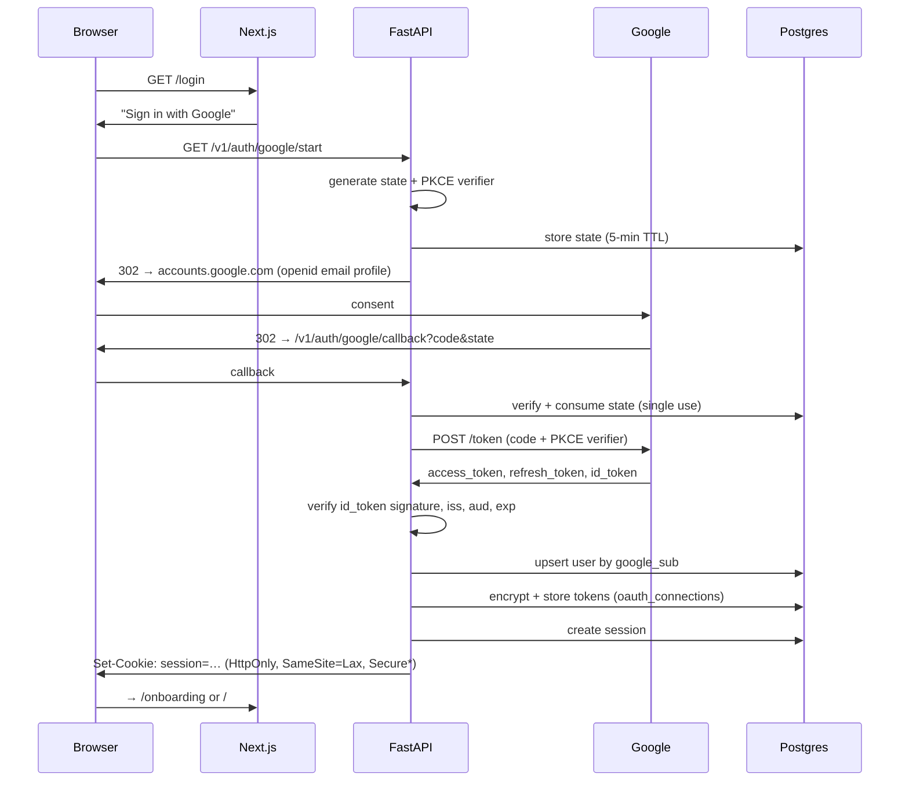
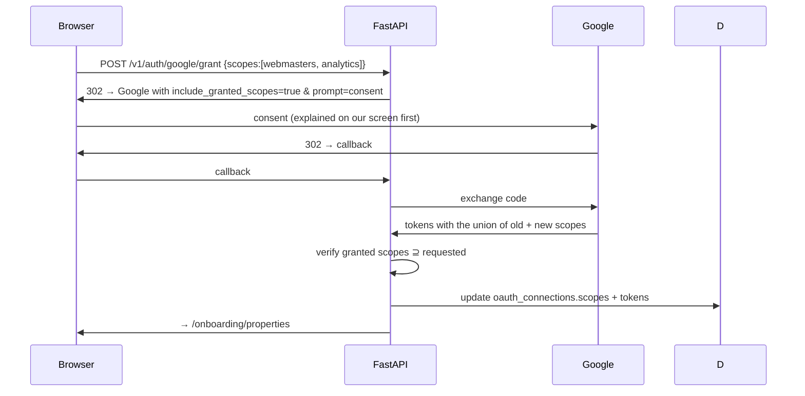

# 06 — API & Authentication

Sections §15–§16. [← Back to index](../README.md)

---

## §15. API Architecture

### Why a separate API service at all

The app could be a single Next.js deployment using Route Handlers and Server Actions. It
isn't, for one reason: **long-running work**. A full-site crawl takes 5–40 minutes. Local
model inference takes 10–120 seconds. Neither fits comfortably in a request/response handler,
and both need to be driven by a Python worker anyway — the crawler, the embedding pipeline,
and the Ollama client are all Python-native.

| Option | Verdict |
|---|---|
| **Next.js only** (Route Handlers + Inngest/Trigger.dev) | Simplest deploy. But background work needs a hosted job service (recurring cost — violates §38), and the crawler/AI stack would have to be rewritten in TypeScript. |
| **Next.js + Node/NestJS API** | One language end-to-end. But `httpx`+`selectolax` crawling, `hdbscan` clustering, and the Ollama Python client have no equal-quality TS equivalents. |
| **Next.js frontend + FastAPI backend + Python worker** | Two languages. But the API and worker share the same Python domain code, the AI/crawl ecosystem is native, and OpenAPI generates the frontend's types automatically. |

**Recommendation: Next.js frontend + FastAPI backend + Python worker.** The API and the worker
import the same `packages/core` modules, so a crawl invoked from a job and a crawl invoked
from an endpoint run identical code. This also matches the proven `web/` + `worker/` split in
`Growleads L.S`.

### Shape

```
┌──────────────────────────────────────────────────────────────────┐
│  Browser                                                         │
└───────────────┬──────────────────────────────────────────────────┘
                │ HTTP + SSE
┌───────────────▼──────────────────────────────────────────────────┐
│  Next.js 15  (localhost:3000)                                    │
│    · RSC render — reads Postgres directly for page data          │
│    · Client components call the API for mutations + streams      │
└───────────────┬──────────────────────────────────────────────────┘
                │ REST / OpenAPI 3.1
┌───────────────▼──────────────────────────────────────────────────┐
│  FastAPI  (localhost:8000)                                       │
│    · auth, RBAC, RLS session vars                                │
│    · CRUD, queries, job enqueue                                  │
│    · SSE for AI streaming + job progress                         │
└───────┬──────────────────────────────┬───────────────────────────┘
        │                              │
┌───────▼──────────┐         ┌─────────▼──────────────────────────┐
│  Postgres 16     │◀────────│  Python worker pool                │
│  + pgvector      │  SKIP   │   crawl · sync · ai · report queues│
│  (jobs = queue)  │  LOCKED │                                    │
└──────────────────┘         └─────────┬──────────────────────────┘
                                       │
                             ┌─────────▼──────────┐
                             │  Ollama (11434)    │
                             │  qwen3.5:9b        │
                             │  nomic-embed-text  │
                             └────────────────────┘
```

**RSC reads Postgres directly.** Page loads don't round-trip through FastAPI — a Server
Component queries the materialised views itself. FastAPI handles mutations, jobs, streaming,
and anything a client component needs. This halves latency on the screens that matter (§11)
without giving up a real API.

### Conventions

**Base path:** `/v1`. Version in the path, not a header — this is an API a future mobile app
or Zapier integration might consume.

**Resource paths mirror the tenancy hierarchy:**

```
/v1/orgs/{org_id}/clients
/v1/orgs/{org_id}/clients/{client_id}/sites
/v1/orgs/{org_id}/sites/{site_id}/gsc/queries
/v1/orgs/{org_id}/sites/{site_id}/issues
/v1/orgs/{org_id}/sites/{site_id}/crawls
```

`org_id` is redundant — it's derivable from the session — but making it explicit means
every URL is unambiguous in logs, and a mismatch between path and session is a loud 403
rather than a silent cross-tenant read.

**Envelope — every list response:**

```json
{
  "data": [ … ],
  "meta": { "total": 3412, "limit": 50, "offset": 0, "has_more": true }
}
```

**Errors — RFC 9457 Problem Details:**

```json
{
  "type": "https://seo-os.local/errors/quota-exhausted",
  "title": "Google API quota exhausted",
  "status": 429,
  "detail": "GSC quota for property sc-domain:acme.com is exhausted. Sync resumes at 00:00 UTC.",
  "instance": "/v1/orgs/…/sites/…/sync",
  "retry_after": 18420
}
```

A machine-readable `type`, a human-readable `detail` that the UI can show verbatim, and — for
retryable conditions — the actual wait. §7's failure-mode table is implemented here.

### Endpoint catalogue

**Auth**

| Method | Path | Purpose |
|---|---|---|
| `GET` | `/v1/auth/google/start` | Begin OAuth, returns consent URL |
| `GET` | `/v1/auth/google/callback` | Exchange code, create session |
| `POST` | `/v1/auth/logout` | Revoke session |
| `GET` | `/v1/auth/me` | Current user, org, role, permissions |
| `POST` | `/v1/auth/google/grant` | Incremental scope grant (GSC/GA4/GBP) |

**Tenancy**

| Method | Path |
|---|---|
| `GET POST` | `/v1/orgs/{org}/clients` |
| `GET PATCH DELETE` | `/v1/orgs/{org}/clients/{client}` |
| `GET POST` | `/v1/orgs/{org}/clients/{client}/sites` |
| `GET PATCH DELETE` | `/v1/orgs/{org}/sites/{site}` |
| `GET POST DELETE` | `/v1/orgs/{org}/clients/{client}/portal-tokens` |

**Analytics**

| Method | Path | Notes |
|---|---|---|
| `GET` | `/v1/orgs/{org}/sites/{site}/gsc/queries` | filters: `start`,`end`,`country`,`device`,`min_impressions`,`position_range` |
| `GET` | `…/gsc/pages` | |
| `GET` | `…/gsc/opportunities` | reads `mv_query_opportunities` |
| `GET` | `…/ga4/landing-pages` | |
| `GET` | `…/performance` | the GSC⋈GA4 join |
| `POST` | `…/sync` | enqueue; returns `202` + `job_id` |

**Technical**

| Method | Path | Notes |
|---|---|---|
| `GET` | `…/issues` | `?state=open&since=last_visit` powers the New tab |
| `PATCH` | `…/issues/{id}` | ignore / resolve |
| `GET POST` | `…/crawls` | POST returns `202` + `job_id` |
| `GET` | `…/crawls/{id}/diff` | vs previous crawl |
| `GET` | `…/pages` | |
| `GET` | `…/health` | |

**Research & content**

| Method | Path |
|---|---|
| `GET POST` | `…/clusters` |
| `GET` | `…/clusters/{id}/queries` |
| `GET POST` | `…/briefs` |
| `GET PATCH` | `…/briefs/{id}` |
| `POST` | `…/briefs/{id}/generate-draft` |
| `GET PATCH` | `…/drafts/{id}` |
| `POST` | `…/drafts/{id}/publish` |
| `GET POST` | `…/linking/suggestions` |
| `POST` | `…/schema/generate` |

**AI & reports**

| Method | Path | Notes |
|---|---|---|
| `POST` | `…/chat` | **SSE stream** |
| `GET` | `…/chat/sessions` | |
| `GET POST` | `…/reports` | |
| `PATCH` | `…/reports/{id}` | edit narrative, approve |
| `GET` | `…/reports/{id}/pdf` | |
| `GET` | `/v1/orgs/{org}/action-plan` | cross-client |

**Jobs**

| Method | Path | Notes |
|---|---|---|
| `GET` | `/v1/orgs/{org}/jobs` | |
| `GET` | `/v1/orgs/{org}/jobs/{id}` | |
| `GET` | `/v1/orgs/{org}/jobs/stream` | **SSE** — live progress for the activity widget |
| `POST` | `/v1/orgs/{org}/jobs/{id}/cancel` | |

### Streaming

Two SSE endpoints, because both are genuinely long-lived and neither justifies WebSockets
(traffic is one-directional).

**AI chat** — token streaming from Ollama:

```
POST /v1/orgs/{org}/sites/{site}/chat
Accept: text/event-stream

event: retrieval
data: {"chunks":7,"sources":["gsc_daily","crawls","issues"]}

event: token
data: {"t":"Blog"}

event: token
data: {"t":" clicks"}

event: citation
data: {"ref":"c1","table":"crawls","id":"…","label":"crawl · 12 Nov"}

event: done
data: {"run_id":"…","duration_ms":8420,"tokens":312}
```

The `retrieval` event fires before generation so the UI can show "searching your data…"
during the RAG step, which is otherwise a silent 1–2 second pause.

**Job progress:**

```
GET /v1/orgs/{org}/jobs/stream

event: progress
data: {"job_id":"…","kind":"crawl_site","pct":34,"detail":"612 / 1,842 pages"}

event: finished
data: {"job_id":"…","status":"succeeded","summary":{"pages":1842,"new_issues":14}}
```

Implemented by `LISTEN`/`NOTIFY` on Postgres — the worker notifies, FastAPI relays. No polling,
no extra infrastructure.

### Idempotency

Any `POST` that costs real work accepts `Idempotency-Key`. Replaying the same key within 24
hours returns the original response rather than starting a second crawl.

Backed at the database level by the partial unique index from §13.8:

```sql
CREATE UNIQUE INDEX jobs_unique_pending ON jobs (site_id, kind)
    WHERE status IN ('queued','running');
```

Double-clicking "Crawl now" cannot enqueue two crawls, even if the application-level check
races.

### Pagination

Offset pagination for UI tables (users jump to page 7), keyset for exports and any endpoint
that can exceed 10,000 rows:

```
GET …/gsc/queries?limit=50&offset=200            # UI
GET …/gsc/queries?limit=1000&after=<cursor>      # export
```

Offset beyond 10,000 returns `400` pointing at the keyset form — an offset scan that deep on
a 33M-row table is a performance incident waiting to happen.

### API keys (for future automation)

```sql
CREATE TABLE api_keys (
    id            uuid PRIMARY KEY DEFAULT gen_random_uuid(),
    org_id        uuid NOT NULL REFERENCES organizations(id) ON DELETE CASCADE,
    name          text NOT NULL,
    key_prefix    text NOT NULL,          -- 'sk_live_a1b2' — shown in the UI
    key_hash      text NOT NULL UNIQUE,   -- sha256 of the full key
    scopes        text[] NOT NULL DEFAULT '{read}',
    last_used_at  timestamptz,
    expires_at    timestamptz,
    revoked_at    timestamptz,
    created_at    timestamptz NOT NULL DEFAULT now()
);
```

Sent as `Authorization: Bearer sk_live_…`. Only the hash is stored. Scoped `read`, `write`,
`admin`. Not needed for MVP but the table exists so adding it later is not a migration.

### OpenAPI

FastAPI generates the spec from Pydantic models. Two consequences worth having:

1. `openapi-typescript` generates the frontend's types at build time, so a backend field
   rename is a compile error in the frontend rather than a runtime `undefined`.
2. `/v1/docs` gives a working API explorer for free — useful when debugging a job payload.

---

## §16. Authentication Flow

### The two distinct grants

This is the part most people get wrong. There are **two separate OAuth purposes**, and
conflating them produces a consent screen that scares users away on first run.

| Grant | Scopes | When | Why separate |
|---|---|---|---|
| **Identity** | `openid`, `email`, `profile` | Sign-in | Minimal, familiar, instantly approved |
| **Data access** | `webmasters.readonly`, `analytics.readonly`, `business.manage` | After onboarding step 2 | Scary-looking, needs context to explain |

Asking for Search Console access on the sign-in screen — before the user knows what the app
is — is the single biggest drop-off risk in onboarding. **Incremental authorisation** splits
them: sign in with the minimal set, then request data scopes on a screen that explains
exactly why each is needed (§12.15).

### Sign-in sequence



\* `Secure` is set when served over HTTPS. On plain `http://localhost` the browser treats
localhost as a secure context for most purposes; §29 covers the local-only threat model.

### Incremental data grant



`include_granted_scopes=true` means the new token carries *both* grants — the user isn't
re-consenting to sign-in every time. `prompt=consent` is required to reliably receive a
refresh token on re-grant.

**Partial grant is handled explicitly.** Google lets a user tick Search Console and untick
Analytics. The callback compares granted against requested and, if Analytics is missing, the
UI marks GA4 features unavailable with a one-click re-request — rather than failing
mysteriously later.

### Sessions

**Opaque server-side sessions, not JWTs.**

| Option | Verdict |
|---|---|
| **JWT in cookie** | Stateless, no lookup. But cannot be revoked before expiry, and role changes don't take effect until re-issue. |
| **Opaque token + DB lookup** | One indexed read per request (sub-millisecond, same machine). Instantly revocable. Role changes apply immediately. |

**Recommendation: opaque sessions.** The stateless advantage of JWTs matters when auth servers
and API servers are separate machines. Here they share a Postgres instance on localhost. Give
up nothing, gain instant revocation.

```sql
CREATE TABLE sessions (
    id              uuid PRIMARY KEY DEFAULT gen_random_uuid(),
    token_hash      text NOT NULL UNIQUE,
    user_id         uuid NOT NULL REFERENCES users(id) ON DELETE CASCADE,
    org_id          uuid NOT NULL REFERENCES organizations(id) ON DELETE CASCADE,
    ip              inet,
    user_agent      text,
    expires_at      timestamptz NOT NULL,
    last_used_at    timestamptz NOT NULL DEFAULT now(),
    revoked_at      timestamptz,
    created_at      timestamptz NOT NULL DEFAULT now()
);
CREATE INDEX ON sessions (user_id) WHERE revoked_at IS NULL;
```

Cookie: `HttpOnly`, `SameSite=Lax`, `Path=/`, 30-day expiry with a sliding refresh when a
session is used past its halfway point.

### Refresh token rotation

Google refresh tokens don't expire on their own but can be revoked by the user at any time.
The worker needs valid tokens at 02:00 with nobody watching.

```
Before any Google API call:
  ├─ token_expires_at > now() + 5 min ?  →  use it
  ├─ else refresh:
  │     POST /token grant_type=refresh_token
  │     ├─ 200 → encrypt + store new access token, update expiry
  │     └─ 400 invalid_grant → user revoked access
  │           ├─ mark oauth_connections.revoked_at
  │           ├─ pause every sync job for that org
  │           └─ notify: "Reconnect Google" on the affected client card
  └─ proceed
```

**A revoked token affects one org's connection, never the whole app.** Other clients keep
syncing. This isolation is the reason `oauth_connections` is keyed per org+user rather than
globally.

### Token encryption at rest

```python
# packages/core/crypto.py
from cryptography.fernet import Fernet
import os

_key = os.environ["TOKEN_ENCRYPTION_KEY"]   # 32-byte urlsafe base64, generated by setup.sh
_f = Fernet(_key)

def encrypt(plaintext: str) -> bytes:
    return _f.encrypt(plaintext.encode())

def decrypt(ciphertext: bytes) -> str:
    return _f.decrypt(ciphertext).decode()
```

Fernet gives AES-128-CBC with HMAC-SHA256 and a timestamp, which is sufficient here and hard
to misuse. The key lives in `.env`, generated once by `setup.sh`, never committed.

**What this protects against:** a stolen or shared Postgres backup, or a `pg_dump` in a
support ticket. It does not protect against an attacker with code execution on the machine —
they can read `.env`. §29 states that boundary plainly rather than overclaiming.

### RBAC

Enforced twice, deliberately: once in the API layer for good error messages, once by Postgres
RLS so a bug in the first layer cannot leak data.

| Role | Sites | Content | Settings | Billing | Notes |
|---|---|---|---|---|---|
| `owner` | CRUD | CRUD | CRUD | CRUD | One per org |
| `admin` | CRUD | CRUD | CRUD | read | |
| `strategist` | read + crawl | CRUD | read | — | Priya |
| `writer` | read | own drafts | — | — | Rahul |
| `client_viewer` | read, scoped | read published | — | — | Portal only |

```python
# apps/api/deps.py
async def require(permission: str, request: Request) -> Principal:
    p = request.state.principal
    if permission not in ROLE_PERMISSIONS[p.role]:
        raise HTTPException(403, detail=f"Role '{p.role}' cannot {permission}")
    return p
```

And per transaction, before any query touches tenant data:

```python
async with db.transaction() as tx:
    await tx.execute("SELECT set_config('app.current_org_id', $1, true)", p.org_id)
    await tx.execute("SELECT set_config('app.current_role',   $1, true)", p.role)
    if p.role == "client_viewer":
        await tx.execute("SELECT set_config('app.current_client_id', $1, true)", p.client_id)
    # every query in this transaction is now RLS-scoped
```

`set_config(..., true)` scopes to the transaction, so a pooled connection cannot leak
settings between requests. This is the detail that makes RLS safe with connection pooling.

### Portal token authentication

The `client_viewer` path has no user account:

```
GET /portal/{token}
  ├─ sha256(token) → portal_tokens.token_hash
  ├─ check revoked_at IS NULL, expires_at > now()
  ├─ if passcode_hash set → prompt, verify
  ├─ create a short-lived (2 h) session with role=client_viewer,
  │  org_id + client_id from the token row
  ├─ increment view_count, set last_viewed_at
  └─ render the portal
```

Rate-limited to 10 attempts per IP per hour, because the token is the only secret. Every view
lands in `audit_log`, so an agency can see when a client last opened their dashboard — which
turns out to be commercially useful information.

---

[← 05 Database](05-database.md) · [Index](../README.md) · [Next: 07 — AI Architecture →](07-ai-architecture.md)
