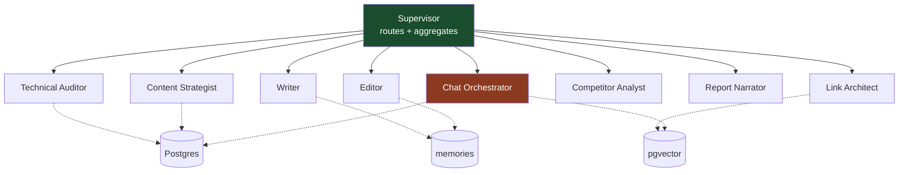
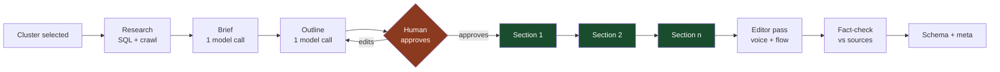
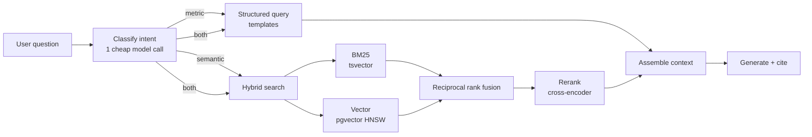

# 07 — AI Architecture

Sections §17–§22. [← Back to index](../README.md)

---

## §17. AI Agent Architecture

### The constraint that shapes everything

A 9B model on an M5 is not a small frontier model. It is a genuinely different tool, and
designing for it means inverting the usual assumptions:

| Frontier-model assumption | What actually applies here |
|---|---|
| Stuff the context, the model will find what matters | Attention degrades badly past ~8k tokens. Retrieve narrowly, pass little. |
| One prompt, one big output | Many small constrained calls beat one large open one. |
| Let the model decide the structure | Constrain output to a JSON schema. Structure is free; freedom is expensive. |
| Chain-of-thought improves quality | With schema-constrained output it mostly burns tokens. Measured 27s → 0.8s with it off. |
| Tokens cost money, so minimise calls | Tokens cost *time*, not money. Twelve cheap calls are fine; one slow call is not. |

Every design decision below follows from that table.

### Three proven patterns carried from `Growleads L.S`

This is not theory — these are measured on this machine, in the sibling project.

**1. Schema-constrained decoding.** Ollama's `format` parameter constrains generation to a
JSON schema, so output is valid *by construction*. No regex scraping, no parse-retry loop, no
"please respond only with JSON" pleading in the prompt.

```python
resp = ollama.chat(
    model="qwen3.5:9b",
    messages=[{"role": "system", "content": system},
              {"role": "user",   "content": user}],
    format=ISSUE_ANALYSIS_SCHEMA,      # JSON Schema — enforced by the sampler
    options={"temperature": 0.2, "num_ctx": 8192},
    think=False,                       # see below
)
```

**2. Reasoning disabled by default.** Qwen 3.5 is a reasoning model. Left on, it emits
hundreds of chain-of-thought tokens before the JSON, and a single structured call takes
minutes instead of seconds. `Growleads L.S` measured **27s → 0.8s** on a trivial prompt by
turning it off. The schema already constrains the output, so the reasoning buys nothing for
structured tasks.

`think=False` is the default for every agent. Three exceptions turn it back on, because they
are genuinely open-ended: the Action Plan Generator, the Chat Assistant's multi-hop questions,
and the Report Narrator's causal analysis. Configurable per prompt via
`prompt_versions.model_hint`, and globally via `OLLAMA_THINK=1` for debugging.

**3. Chunked windows over long inputs.** L.S scores overlapping 8-minute transcript windows
rather than feeding a whole hour, because a 9B model's attention degrades across 12k tokens.
The same applies here — a 1,800-page crawl, a 4,000-word competitor article, a 3,000-row
query export. Chunk, process, then aggregate in code.

### Agent roster

Eight agents. Each has one job, a fixed tool set, and a JSON schema for its output.



| Agent | Job | Tools | Output schema | `think` |
|---|---|---|---|---|
| **Technical Auditor** | Group raw crawl findings into issues; write explanation + remediation | `query_issues`, `query_pages`, `query_gsc` | `{issues:[{rule_key,severity,explanation,remediation,affected_urls}]}` | off |
| **Content Strategist** | Label clusters, classify intent, score opportunity, build the plan | `query_clusters`, `query_pages`, `query_gsc` | `{label,intent,opportunity_score,rationale}` | off |
| **Writer** | Generate one outline section at a time | `get_brief`, `get_memory`, `get_prev_section` | `{markdown}` | off |
| **Editor** | Voice, flow, factual consistency against source data | `get_memory`, `get_brief`, `get_draft` | `{markdown,changes:[{type,note}]}` | off |
| **Link Architect** | Rank internal link candidates, write anchors, pick placement | `vector_search`, `query_pages`, `query_links` | `{suggestions:[{from,to,anchor,paragraph,relevance}]}` | off |
| **Competitor Analyst** | Themes, cadence, structural gaps from crawled competitor pages | `query_competitor_pages`, `vector_search` | `{themes,cadence,gaps,schema_usage}` | off |
| **Report Narrator** | Executive summary + causal narrative for reports | `query_gsc`, `query_ga4`, `query_issues`, `query_crawl_diff` | `{summary,sections:[{heading,body,citations}]}` | **on** |
| **Chat Orchestrator** | Answer free-form questions over all site data | all read tools + `vector_search` | streamed text + `citations[]` | **on** |

### Orchestration — LangGraph

| Option | Verdict |
|---|---|
| Hand-rolled function calls | No dependency, full control. But retries, partial failure, and step tracing get reinvented badly. |
| CrewAI / AutoGen | Fast to start. Both assume a strong model and chatty multi-agent conversation — exactly wrong for 9B, where every extra turn is 10+ seconds. |
| **LangGraph** | Explicit state graph. Nodes are plain Python functions, edges are conditionals. Deterministic, debuggable, no agent-to-agent chatter. Checkpointing maps onto `agent_steps`. |

**Recommendation: LangGraph**, used in its *deterministic* mode — the graph topology is
written by us, not decided by the model. The model fills nodes; it doesn't route. With a 9B
model, model-driven routing is where things go wrong, and it's also the slowest part.

Example — the technical audit graph:

```python
# packages/agents/technical_audit.py
from langgraph.graph import StateGraph, END

def build_graph():
    g = StateGraph(AuditState)

    g.add_node("load_findings",  load_raw_findings)      # plain SQL, no model
    g.add_node("group_rules",    group_by_rule)          # plain Python, no model
    g.add_node("explain",        explain_issues)         # ← model, batched
    g.add_node("prioritise",     prioritise_issues)      # ← model, one call
    g.add_node("persist",        upsert_issues)          # plain SQL

    g.set_entry_point("load_findings")
    g.add_edge("load_findings", "group_rules")
    g.add_conditional_edges("group_rules",
        lambda s: "explain" if s.new_or_changed else "persist")
    g.add_edge("explain", "prioritise")
    g.add_edge("prioritise", "persist")
    g.add_edge("persist", END)
    return g.compile()
```

**Note how little of this graph is the model.** Loading, grouping, and persisting are SQL and
Python. Two nodes call Ollama, and one of them is skipped entirely when nothing changed since
the last crawl. This is the single biggest performance lever in the system — *don't call the
model when code can answer*.

### The blog generation pipeline (the hardest case)

Module 9 is where a 9B model is genuinely weakest (§5). The pipeline is the mitigation, and
it is the design rather than a workaround.



**Why this works at 9B when one-shot generation doesn't:**

Each Writer call receives only:
- its own outline node (heading + intent notes + target queries), ~200 tokens
- the last paragraph of the previous section, for continuity, ~100 tokens
- brand voice rules from memory, ~150 tokens
- 2–3 retrieved facts relevant to *this section only*, ~400 tokens

That is roughly **900 tokens of context to produce ~300 words**. The model is operating well
inside its competence, on a task with a clear boundary. One-shot generation asks it to hold
2,000 words of structure, voice, coverage, and factual consistency simultaneously — which is
exactly where a 9B model falls apart.

**The human approval gate on the outline is not optional.** It is the cheapest possible
intervention point: 30 seconds of a strategist's attention prevents 1,800 words of
well-written content about the wrong thing.

**Honest cost:** ~3–5 minutes for 1,800 words, and ~35 minutes of human editing after (§7
Journey 3). The claim is that the pipeline removes research, structuring, and the blank page —
not that it removes writing.

### The provider adapter

Both the LLM layer and the SERP layer (§24) use the same pattern. Stating it once:

```python
# packages/core/providers.py
class LLMProvider(Protocol):
    async def complete(self, *, system: str, user: str,
                       schema: dict | None, think: bool) -> dict | str: ...

class OllamaProvider:                   # default, $0
    async def complete(self, **kw): ...

class RemoteProvider:                   # opt-in, user's own key
    """Only invoked for task kinds the user explicitly ticked in Settings."""
    async def complete(self, **kw): ...

def provider_for(task_kind: str, org_settings: dict) -> LLMProvider:
    remote = org_settings.get("remote_llm", {})
    if remote.get("enabled") and task_kind in remote.get("task_kinds", []):
        return RemoteProvider(remote)
    return OllamaProvider()
```

Three properties this guarantees:

1. **Nothing leaves the machine unless explicitly ticked.** Default is local, per task kind.
2. **The platform never carries a cost.** A remote call uses the user's own key.
3. **No code path assumes a provider.** Agents call `provider_for(...)`, so switching is a
   settings change, not a refactor.

### Concurrency

One Ollama instance, one GPU. Inference is effectively serialised.

```
ai queue           → 1 worker  (Ollama is the bottleneck; more workers just queue)
crawl queue        → 4 workers (network-bound, no GPU)
sync queue         → 2 workers (network-bound)
report queue       → 1 worker  (calls the ai queue internally)
```

The `ai` queue having exactly one worker is deliberate. Two workers hitting one Ollama
instance produces contention and roughly halves each request's speed with no throughput gain —
plus a second loaded model would exceed 16 GB.

Model residency matters too: keep `qwen3.5:9b` warm with `OLLAMA_KEEP_ALIVE=30m`. A cold load
costs 6–10 seconds, which is unacceptable on the Chat Assistant's first message.

---

## §18. Prompt Engineering Strategy

### Prompts are versioned data, not code

Prompts live in `prompt_versions` (§13.7), not in Python string literals. Reasons:

- Editable without a redeploy — important while tuning a small model
- `agent_runs.prompt_version_id` records which version produced which output, so a quality
  regression is traceable to a specific edit
- A/B comparison is a query, not a git archaeology exercise

Never edited in place. A change inserts a new version and flips `is_active`.

### Four-layer composition

Every prompt is assembled from four layers, most stable first. This ordering also happens to
be optimal for any future caching, but the real reason is comprehension: the model sees who
it is before what it must do.

```
┌─ Layer 1  IDENTITY  (per agent, changes rarely) ───────────────┐
│  You are a technical SEO auditor. You analyse crawl data and    │
│  explain issues to an SEO professional who will act on them.    │
├─ Layer 2  RULES  (per agent) ──────────────────────────────────┤
│  · Never state a cause you cannot evidence from the data given. │
│  · Quantify impact using the impressions provided.              │
│  · Remediation must be a concrete action, not "consider fixing".│
├─ Layer 3  CONTEXT  (per site, from memory + retrieval) ────────┤
│  Site: acme.com · WordPress · 1,842 pages                       │
│  Known: CDN strips trailing slashes (confirmed by user, Sep 26) │
├─ Layer 4  TASK  (per call) ────────────────────────────────────┤
│  14 URLs returned 404 in the crawl of 12 Nov. They returned 200 │
│  on 5 Nov. Combined impressions last 28d: 1,240.                │
│  URLs: …                                                        │
└─────────────────────────────────────────────────────────────────┘
```

### XML tags, not markdown headings

For a 9B model, XML-style delimiters separate context sections noticeably more reliably than
markdown headers — headers get confused with content that *contains* markdown, which crawled
page bodies invariably do.

```
<site_context>
  domain: acme.com
  platform: WordPress
  pages: 1842
</site_context>

<known_facts>
  - CDN strips trailing slashes (user-confirmed, 2026-09-14)
  - /shop/* is excluded from crawling by configuration
</known_facts>

<finding>
  rule: http.404
  urls_affected: 14
  first_seen: 2026-11-12
  previously_200_on: 2026-11-05
  impressions_28d: 1240
  sample_urls: [...]
</finding>

<task>
Explain this finding and give remediation steps.
</task>
```

### Output schemas do the work prose can't

Rather than instructing "respond with severity, explanation, and remediation," constrain it:

```python
ISSUE_ANALYSIS_SCHEMA = {
    "type": "object",
    "properties": {
        "severity":    {"type": "string", "enum": ["critical", "warning", "notice"]},
        "explanation": {"type": "string", "maxLength": 400},
        "remediation": {"type": "string", "maxLength": 600},
        "impact_note": {"type": "string", "maxLength": 200},
        "confidence":  {"type": "string", "enum": ["high", "medium", "low"]},
    },
    "required": ["severity", "explanation", "remediation", "confidence"],
    "additionalProperties": False,
}
```

`maxLength` is the effective verbosity control — far more reliable than "be concise" in a
9B prompt. `confidence` is required specifically so the model has a legitimate way to hedge
*inside the structure* rather than hedging in prose, which is what produces the mushy
"it may be possible that…" output that makes AI text obvious.

### Six rules for prompting a 9B model

**1. One task per call.** "Analyse this issue and also suggest content" gets you two mediocre
answers. Split it.

**2. Give examples, not adjectives.** "Write in a practical tone" is nearly inert. Two
sentences of the client's actual copy is worth more than a paragraph of description. This is
why `brand_voice` (§22) stores *samples*, not adjectives.

**3. Negative constraints go in the schema, not the prose.** "Don't use bullet points"
frequently produces bullet points. `{"type":"string"}` with a rule that the Editor strips
list markup is deterministic.

**4. Put the task last.** Small models weight the end of the prompt more heavily. Context
first, instruction last.

**5. Never ask for a number the model can't compute.** "Estimate the traffic impact" invites
a hallucinated figure. Compute it in SQL, pass it in, and ask the model to *explain* it.

**6. Require citations structurally.** The Chat Orchestrator's schema includes a `citations`
array whose entries must reference row IDs that were actually in the retrieved context. A
citation to an ID that wasn't retrieved is rejected in post-processing and the answer is
regenerated. This is what makes §12.7's bracketed references trustworthy rather than
decorative.

### Evaluation

Small models drift with prompt changes in ways large models tolerate. Without an eval set,
prompt tuning is superstition.

```
packages/agents/evals/
├─ technical_auditor/
│   ├─ cases.jsonl          # 40 real findings with human-written expected output
│   └─ rubric.py            # severity match, action concreteness, no unevidenced claims
├─ content_strategist/
│   └─ cases.jsonl          # 30 clusters with human labels + intents
└─ report_narrator/
    └─ cases.jsonl          # 20 months of real data with human summaries
```

Scoring per case:

| Check | Method |
|---|---|
| Schema validity | Structural — 100% required, any failure is a hard fail |
| Field accuracy (severity, intent) | Exact match against the human label |
| No unevidenced causal claims | Regex + a checker pass — the highest-value check |
| Numeric accuracy | Any number in the output must appear in the input |
| Style | Human spot-check on a 10% sample |

Run on every prompt version change. A version cannot be marked `is_active` until it scores at
least as well as the current active version. This is the discipline that keeps a small model
usable over months of tinkering.

---

## §19. RAG Architecture

### What is indexed, and what deliberately is not

The mistake would be to embed everything. Most of this data is **structured and better
queried with SQL**. Vector search is only for the parts where semantic similarity is the
right retrieval mechanism.

| Data | Retrieval | Why |
|---|---|---|
| Page content | **Vector** | "pages about refrigeration maintenance" is semantic |
| Brand voice samples | **Vector** | Retrieve the most stylistically relevant sample |
| Past report narratives | **Vector** | "what did we say about this last quarter" |
| Competitor page content | **Vector** | Topical gap analysis is similarity |
| GSC queries | **Vector** (aggregated) | Clustering; not per-row |
| GSC daily rows | **SQL** | "clicks last 28 days" is an aggregate, not a similarity |
| GA4 rows | **SQL** | Same |
| Issues | **SQL** | Filter by state, severity, date |
| Crawl diffs | **SQL** | Set comparison |
| Jobs, users, settings | **SQL** | Never embedded |

**Roughly 90% of the Chat Assistant's answers come from SQL, not vectors.** The retrieval
layer routes the question first, and only reaches for pgvector when the question is genuinely
semantic. This is faster, cheaper in time, and dramatically more accurate for the numeric
questions users actually ask.

### Hybrid retrieval pipeline



**Intent classification first.** One ~200ms schema-constrained call decides whether the
question needs metrics, semantics, or both, and which site/date range applies:

```python
ROUTE_SCHEMA = {
    "type": "object",
    "properties": {
        "needs_metrics":  {"type": "boolean"},
        "needs_semantic": {"type": "boolean"},
        "metric_kinds":   {"type": "array", "items": {"type": "string",
                            "enum": ["gsc","ga4","issues","crawl_diff","rank","content"]}},
        "date_range":     {"type": "string", "enum": ["7d","28d","90d","mtd","ytd","custom"]},
        "semantic_query": {"type": "string"},
    },
    "required": ["needs_metrics", "needs_semantic"],
    "additionalProperties": False,
}
```

**Hybrid, not pure vector.** BM25 over `pages_fts` catches exact terms — product names, error
codes, URLs — that embeddings blur. Vector catches paraphrase. Reciprocal rank fusion
combines them without tuning a weight:

```sql
WITH vec AS (
    SELECT id, row_number() OVER (ORDER BY embedding <=> $1) AS rank
    FROM embeddings
    WHERE site_id = $2 AND source_type = 'page'
    ORDER BY embedding <=> $1 LIMIT 30
),
bm AS (
    SELECT e.id, row_number() OVER (
        ORDER BY ts_rank(to_tsvector('english', e.content),
                         plainto_tsquery('english', $3)) DESC) AS rank
    FROM embeddings e
    WHERE e.site_id = $2 AND e.source_type = 'page'
      AND to_tsvector('english', e.content) @@ plainto_tsquery('english', $3)
    LIMIT 30
)
SELECT COALESCE(vec.id, bm.id) AS id,
       COALESCE(1.0/(60 + vec.rank), 0) + COALESCE(1.0/(60 + bm.rank), 0) AS score
FROM vec FULL OUTER JOIN bm USING (id)
ORDER BY score DESC
LIMIT 10;
```

The constant 60 is the standard RRF damping value; it needs no tuning and is robust across
query types.

**Reranking.** The top 10 fused results are reranked by a small cross-encoder
(`bge-reranker-base`, ~280 MB, runs on CPU in ~80 ms for 10 pairs) and the top 4 are passed
to the model. Retrieving 30 and passing 4 is deliberate: recall comes from retrieval breadth,
precision from reranking, and the 9B model only ever sees a small, highly relevant context.

### Context budget

Hard budget of **6,000 tokens** for retrieved context, against an 8,192 `num_ctx`. Exceeding
it degrades answer quality measurably rather than gracefully.

| Slot | Budget |
|---|---|
| System + rules | 400 |
| Site context + memories | 400 |
| Structured query results (tables) | 2,000 |
| Retrieved chunks (4 × ~350) | 1,400 |
| Conversation history (last 3 turns) | 1,200 |
| Question + reserve | 600 |

When results exceed a slot, they are **summarised in code, not truncated** — a 200-row GSC
result becomes "top 10 rows + aggregate totals," which preserves the answer's correctness.
Truncation silently loses the row that mattered.

### Chunking

| Source | Strategy | Size | Overlap |
|---|---|---|---|
| Page body | Heading-aware — split at `h2`/`h3`, never mid-section | 400–600 tok | 60 tok |
| Long section | Sentence-boundary sub-split | 500 tok | 60 tok |
| Report narrative | One chunk per report section | variable | 0 |
| Brand voice sample | One chunk per sample | ≤500 tok | 0 |
| Competitor page | Same as page body | 400–600 tok | 60 tok |

Heading-aware chunking matters more than the exact size. A chunk that spans two H2s answers
neither question well; a chunk aligned to a section is self-contained and cites cleanly.

Every chunk carries metadata used for pre-filtering before the vector scan:

```json
{ "url": "https://acme.com/blog/maintenance",
  "title": "Commercial Refrigeration Maintenance",
  "heading": "Monthly checklist",
  "position_in_page": 3,
  "word_count": 480,
  "last_crawled": "2026-11-12" }
```

---

## §20. Embedding Strategy

### Model choice

| Model | Dims | Size | MTEB | Verdict |
|---|---|---|---|---|
| `all-MiniLM-L6-v2` | 384 | 90 MB | ~56 | Fast, but weak on longer passages |
| **`nomic-embed-text`** | **768** | **275 MB** | **~62** | 8k context, Ollama-native, strong quality-per-MB |
| `bge-m3` | 1024 | 1.2 GB | ~66 | Better, multilingual — but 4× the RAM and 1024 dims inflate the index |
| `mxbai-embed-large` | 1024 | 670 MB | ~64 | Good; no decisive advantage over nomic here |

**Recommendation: `nomic-embed-text`.** The decider is the **8,192-token context window** —
it embeds a full page section without pre-chunking twice, and its 768 dimensions keep the
HNSW index at roughly 700 MB for 180k vectors (§13). On a 16 GB machine already holding a
5.5 GB LLM, 275 MB is the right budget for embeddings.

`bge-m3` is genuinely better and is the documented upgrade if multilingual client sites
appear. Changing it requires a full re-embed and a `vector(1024)` migration — hence the
`embedding_model` field recorded in `embeddings.metadata` so a mixed-dimension state is
detectable rather than silently wrong.

### What gets embedded, and when

```
Trigger                          Action
─────────────────────────────────────────────────────────────────
Crawl finds new/changed page  →  chunk, embed, upsert
Page content_hash unchanged   →  skip entirely
Brand voice edited            →  re-embed that org's voice samples
Report approved               →  embed its narrative
Competitor crawled            →  chunk, embed
Query set changes >10%        →  re-embed queries, re-cluster
```

**`content_hash` is the most important optimisation in the pipeline.** A weekly re-crawl of
1,800 pages would otherwise re-embed everything — roughly 25 minutes of GPU time. Hashing
chunk content and skipping unchanged chunks typically skips 95%+, bringing a weekly re-embed
to under 90 seconds.

```python
async def embed_page(page, conn):
    chunks = chunk_by_heading(page.body_text)
    for i, chunk in enumerate(chunks):
        h = sha256(chunk.text.encode()).hexdigest()
        existing = await conn.fetchval(
            "SELECT content_hash FROM embeddings "
            "WHERE source_type='page' AND source_id=$1 AND chunk_index=$2",
            page.id, i)
        if existing == h:
            continue                                   # ← the 95% case
        vec = await ollama.embeddings(model="nomic-embed-text", prompt=chunk.text)
        await conn.execute(UPSERT_EMBEDDING, page.org_id, page.site_id,
                           "page", page.id, i, chunk.text, vec, chunk.meta, h)
```

### Throughput on the M5

Measured expectations, to be verified during build:

| Operation | Rate |
|---|---|
| Embedding, single chunk (~500 tok) | ~25–40 ms |
| Embedding, batched (32 chunks) | ~350–500 ms (~12 ms/chunk) |
| Full site, 1,800 pages, ~5,400 chunks, cold | ~4–6 min |
| Weekly re-embed, 5% changed | ~30–60 s |

**Always batch.** Ollama's embeddings endpoint accepts arrays; batching 32 gives roughly a 3×
throughput improvement over sequential calls, and the crawl pipeline naturally produces
chunks in batches anyway.

### Query embeddings and clustering

Clustering 3,412 GSC queries is a **vector operation, not an LLM operation** (§5, module 6).
The model is used only to name the resulting clusters — one short call per cluster.

```python
# 1. Embed unique queries (batched). ~3,400 queries → ~15 s
vectors = await embed_batch(queries, model="nomic-embed-text")

# 2. Reduce then cluster. UMAP first: HDBSCAN degrades in 768 dims.
reduced = umap.UMAP(n_neighbors=15, n_components=20,
                    metric="cosine", random_state=42).fit_transform(vectors)

labels = hdbscan.HDBSCAN(min_cluster_size=3, min_samples=2,
                         metric="euclidean").fit_predict(reduced)

# 3. One model call per cluster to name it — ~47 calls × 0.8 s ≈ 40 s
for cid in set(labels) - {-1}:
    members = [q for q, l in zip(queries, labels) if l == cid]
    name = await strategist.label_cluster(members[:25])   # top 25 by impressions
```

**Why UMAP before HDBSCAN:** density-based clustering degrades badly in high dimensions.
Reducing 768 → 20 dimensions first produces markedly cleaner clusters. `random_state=42` fixes
the seed so re-running produces stable cluster IDs — otherwise every re-cluster reshuffles the
UI and destroys the user's mental map.

`min_cluster_size=3` means a query trio can form a cluster. Noise (`label = -1`) is retained
as an "ungrouped" bucket rather than discarded — long-tail queries are often the opportunity.

---

## §21. Vector Database Planning

### pgvector, and the numbers at which that changes

| Option | Verdict |
|---|---|
| **pgvector in the same Postgres** | One service, one backup, joins to relational data in SQL. HNSW is competitive to ~1M vectors. |
| Qdrant (self-hosted, free) | Faster above ~5M vectors, better filtering. Second service, second backup, application-level joins. |
| sqlite-vec | Zero infrastructure. But we already need Postgres for concurrency (§13), so it adds a second store for nothing. |
| Pinecone / Weaviate Cloud | Managed. **Recurring cost — disqualified by §38.** |

**Recommendation: pgvector.** At the projected scale — ~180,000 vectors for 15 clients over
two years (§13) — pgvector with an HNSW index answers a filtered similarity query in 8–25 ms.
The decisive advantage isn't speed, it's the join:

```sql
-- Impossible in a single query with an external vector store
SELECT p.url, p.title, e.embedding <=> $1 AS distance,
       sum(g.impressions) AS impressions
FROM   embeddings e
JOIN   pages p ON p.id = e.source_id
LEFT JOIN gsc_daily g ON g.site_id = p.site_id
                     AND g.page = p.url
                     AND g.date >= current_date - 28
WHERE  e.site_id = $2
  AND  e.source_type = 'page'
  AND  p.status_code = 200
GROUP BY p.url, p.title, e.embedding
ORDER BY distance
LIMIT 10;
```

"Find pages semantically similar to this, that return 200, ranked by distance, with their
actual impressions." An external store forces this into three round trips and an in-memory
join.

### Index configuration

```sql
CREATE INDEX embeddings_hnsw ON embeddings
    USING hnsw (embedding vector_cosine_ops)
    WITH (m = 16, ef_construction = 64);

SET hnsw.ef_search = 40;    -- per session; raise for recall, lower for speed
```

| Parameter | Value | Reasoning |
|---|---|---|
| `m = 16` | default | Graph connectivity. 32 improves recall ~2% and doubles index size — not worth it here. |
| `ef_construction = 64` | default | Build-time quality. 128 doubles build time for marginal gain at this scale. |
| `ef_search = 40` | tuned | Query-time breadth. 40 gives ~97% recall@10 at ~15 ms. |

**Always filter before the vector scan.** `WHERE site_id = $1 AND source_type = 'page'` uses
the btree index to shrink the candidate set before HNSW traversal. Without it, a search on a
15-client instance scans all clients' vectors — slower *and* a cross-tenant leak if RLS were
ever bypassed.

### Migration triggers — the actual numbers

Move to Qdrant when **any two** of these hold, not before:

| Trigger | Threshold |
|---|---|
| Vector count | > 2,000,000 |
| p95 similarity query | > 150 ms with `ef_search = 40` |
| Index size | > 8 GB (memory pressure on a 16 GB box) |
| Index rebuild time | > 30 min (blocks weekly maintenance) |
| Need for multi-vector / sparse hybrid at the store level | required |

At 15 clients these are years away. At 200 clients — a hosted scenario (§51) — they arrive.
The abstraction that makes the move cheap already exists in the retrieval layer:

```python
class VectorStore(Protocol):
    async def upsert(self, records: list[Record]) -> None: ...
    async def search(self, vec: list[float], *, filters: dict, k: int) -> list[Hit]: ...

class PgVectorStore:  ...    # default
class QdrantStore:    ...    # documented, unimplemented
```

Only `PgVectorStore` is built. `QdrantStore` is a documented interface, not dead code.

### Maintenance

```sql
-- Weekly, in the maintenance job
REINDEX INDEX CONCURRENTLY embeddings_hnsw;
VACUUM ANALYZE embeddings;

-- Prune vectors for pages that no longer exist
DELETE FROM embeddings e
WHERE e.source_type = 'page'
  AND NOT EXISTS (
      SELECT 1 FROM pages p WHERE p.id = e.source_id AND p.is_gone = false);
```

HNSW indexes degrade with heavy deletion. A weekly concurrent reindex during the maintenance
window keeps query latency flat and takes ~40 seconds at this scale.

---

## §22. AI Memory Strategy

### Three tiers, three lifetimes

| Tier | Lives in | Lifetime | Example |
|---|---|---|---|
| **Run state** | LangGraph checkpoint → `agent_steps` | One agent run | Intermediate findings mid-audit |
| **Conversation** | `chat_messages`, last 3 turns in context | One chat session | "the blog" refers to /blog/ |
| **Long-term facts** | `memories` table | Until changed | Brand voice; "the CDN strips trailing slashes" |

Only the third is interesting; the first two are mechanics.

### Long-term memory

```sql
-- from §13.7
CREATE TABLE memories (
    scope       text NOT NULL,     -- 'org' | 'client' | 'site'
    scope_id    uuid NOT NULL,
    key         text NOT NULL,
    value       jsonb NOT NULL,
    confidence  real NOT NULL DEFAULT 1.0,
    source      text,              -- 'user' | 'inferred'
    expires_at  timestamptz,
    UNIQUE (scope, scope_id, key)
);
```

**Scope resolution is most-specific-wins.** Loading context for a site resolves `site` →
`client` → `org` and merges, so an org-wide writing rule applies everywhere unless a specific
client overrides it.

### What is stored

| Key | Scope | Source | Example |
|---|---|---|---|
| `brand_voice` | client | user | tone, person, spelling, banned words, **2–3 real samples** |
| `content_rules` | client | user | "never mention competitors by name" |
| `known_issue.*` | site | user | "CDN strips trailing slashes — 301s are expected" |
| `technical_context` | site | inferred | "WordPress + WooCommerce + Cloudflare" |
| `seasonality` | client | inferred | "traffic peaks Nov–Jan" |
| `reporting_prefs` | client | user | "client cares about leads, not rankings" |

**`brand_voice` stores samples, not adjectives.** This is the single highest-leverage memory
in the system, per §18 rule 2:

```json
{
  "tone": "practical, direct, no hype",
  "person": "second",
  "spelling": "en-GB",
  "avoid": ["cutting-edge", "seamless", "revolutionise", "in today's world"],
  "samples": [
    "If your walk-in cooler fails on a Friday night, you're not just losing stock — you're losing the weekend's trade.",
    "Most callouts we attend were preventable. Here's what to check monthly."
  ]
}
```

Two sentences of the client's actual writing steer a 9B model further than a paragraph of
description. The Writer and Editor both retrieve this on every call.

### How facts get written

**User-stated (confidence 1.0)** — settings forms, and an explicit "remember this" action in
the Chat Assistant:

> *"The trailing-slash redirects are intentional, our CDN does that. Stop flagging it."*
> → `memories(site, 'known_issue.trailing_slash', {...}, confidence=1.0, source='user')`

The Technical Auditor reads `known_issue.*` before scoring, so the false positive never
reappears. **This is the feature that determines whether the technical scanner stays useful
past month two** — a scanner that keeps reporting a known non-issue gets ignored entirely.

**Inferred (confidence 0.6–0.8)** — written after an agent run, never surfaced as fact
without a confidence marker, and expired after 90 days unless reconfirmed:

```python
await write_memory(scope="site", scope_id=site.id,
                   key="technical_context",
                   value={"cms": "WordPress", "cdn": "Cloudflare"},
                   confidence=0.8, source="inferred",
                   expires_at=now() + timedelta(days=90))
```

### Injection into prompts

Layer 3 of §18's composition. Only memories relevant to the current agent are loaded — the
Writer gets `brand_voice` and `content_rules`; the Technical Auditor gets `known_issue.*` and
`technical_context`. Loading everything wastes a scarce context budget.

```python
async def build_context(agent: str, site_id: UUID) -> str:
    keys = AGENT_MEMORY_KEYS[agent]           # explicit allow-list per agent
    mems = await load_memories(site_id, keys)
    return render_xml("known_facts", [
        {"fact": m.value, "confidence": m.confidence,
         "since": m.updated_at.date()} for m in mems
    ])
```

Inferred memories carry their confidence into the prompt, and Layer 2's rules instruct the
model to treat sub-1.0 facts as provisional. This is why the Report Narrator never asserts
"your CDN causes this" from an inferred fact — it says "this is consistent with the CDN
behaviour recorded in September," which is both accurate and useful.

### What is deliberately not remembered

- **Nothing derivable from the database.** The model doesn't "remember" last month's clicks;
  it queries them. Remembering a stale number and then contradicting live data is worse than
  not remembering at all.
- **Nothing from crawled third-party content.** A competitor's page saying "always use X" is
  data, not a rule. Treating crawled content as instruction is the prompt-injection vector
  covered in §29.
- **No PII beyond what the user entered.** Memories are agency-operational facts, not
  end-user data.

---

[← 06 API & Auth](06-api-auth.md) · [Index](../README.md) · [Next: 08 — Infrastructure →](08-infrastructure.md)
